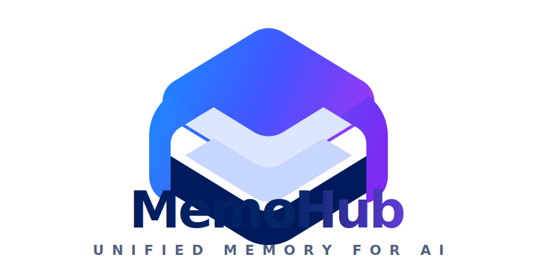
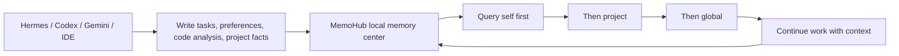

<p align="center">
  
</p>

<p align="center">
  <strong>Turn temporary AI context into your own durable memory assets.</strong>
</p>

<p align="center">
  <a href="README.md">English</a>
  ·
  <a href="README_CN.md">中文</a>
</p>

<p align="center">
  <a href="docs/guides/quickstart.md">Quick Start</a>
  ·
  <a href="docs/integration/access-scenarios.md">Real Scenarios</a>
  ·
  <a href="docs/integration/mcp-integration.md">MCP Integration</a>
  ·
  <a href="skills/memohub/SKILL.md">Agent Skill</a>
  ·
  <a href="docs/README.md">Docs</a>
</p>

<p align="center">
  
  
  
  
</p>

## Why MemoHub

AI Agents are getting stronger, but their memory is often trapped inside one chat, one IDE, one tool, or one temporary session. Switch Agents, and you explain the project again. Switch tools, and the code context is gone. Clarify a fact once, and another Agent may still ask the same question later.

MemoHub closes that gap. It turns memories written by Hermes, Codex, Gemini, AI IDEs, scripts, and external tools into a local, traceable, searchable, and governable memory center.

It is not another note-taking app. It is memory infrastructure for AI: private code memory, durable Agent habits, project decisions, task history, clarification results, and multi-Agent shared context become assets that belong to you.

## The Simple Model

MemoHub gives every Agent portable long-term memory:



## What It Is For

- Private code memory: build a private context layer for your repositories, including files, components, APIs, dependencies, and project conventions.
- Durable Hermes memory: Hermes can remember who it is, how it usually works, what the user prefers, and what it recently did.
- Multi-Agent collaboration: Codex, Gemini, Hermes, and IDE extensions can write into the same project memory layer.
- Agent memory replay: ask “What did Hermes do recently?”, “What am I building now?”, or “Why did we choose this design?” and retrieve the chain.
- Clarification write-back: user-confirmed facts become curated memories and are reused in later queries.
- MCP self-discovery: an Agent can read `memohub://tools` to discover tools, resources, views, logs, and config entry points.

See [Real Scenarios](docs/integration/access-scenarios.md) for complete workflows.

## Core Capabilities

| Capability | What it gives you |
| --- | --- |
| Unified memory objects | Organizes all sources through `CanonicalMemoryEvent`, `MemoryObject`, and `ContextView`. |
| Layered retrieval | Defaults to “self first, then project, then global”. |
| Private code memory | Stores file, component, API, dependency, convention, and code analysis facts in `coding_context`. |
| Multi-Agent memory | Lets Hermes, Codex, Gemini, and IDE tools share project memory. |
| Clarification loop | Writes user-confirmed answers back as curated memories. |
| MCP discovery | Lets Agents inspect `memohub://tools` instead of guessing available tools. |

## Tool Value Map

| Goal | Use | Value |
| --- | --- | --- |
| Store a useful fact | `memohub add` / `memohub_ingest_event` | Turns a one-off conversation result into durable memory. |
| Query the Agent itself | `agent_profile` | Hermes can recover its habits, preferences, and durable rules. |
| Replay recent work | `recent_activity` | Answers what happened recently and who participated. |
| Read project background | `project_context` | Keeps decisions and business context across Agent switches. |
| Read code context | `coding_context` | Gives private repositories their own code memory layer. |
| Write clarification | `resolve-clarification` / `memohub_resolve_clarification` | Prevents repeated explanations after the user confirms a fact. |
| Let Agents self-integrate | `memohub://tools` / Skill | Exposes tools, resources, views, and configuration to Agents. |

## End-to-End Chain

```text
Agent / IDE / CLI
  -> start MCP with memohub serve
  -> read memohub://tools to discover capabilities
  -> query agent_profile / recent_activity / project_context / coding_context
  -> execute the task with retrieved context
  -> write new facts, task results, code analysis, and preferences through memohub_ingest_event
  -> write user clarifications through memohub_resolve_clarification
  -> later Hermes / Codex / Gemini / IDE continue from the same memory assets
```

For Hermes, MemoHub is not just a tool catalog. It is long-term memory: before a task, Hermes can ask “Who am I, how do I usually work, and what did I do recently?” For Codex and AI IDEs, MemoHub is a private code context layer that survives tool switches.

## Identity Binding

Every integration should use stable identities so memories remain traceable, aggregatable, and replayable:

- `actorId`: the Agent using memory, for example `hermes`, `codex`, `gemini`, `vscode`.
- `source`: the writer, for example `hermes`, `codex`, `vscode`, `scanner`.
- `channel`: the source channel or session, for example `hermes:session:2026-04-29` or `vscode:workspace:memo-hub`.
- `projectId`: the project boundary, for example `memo-hub`.
- `sessionId/taskId`: optional IDs that connect a memory to a session or task.

Recommended naming pattern: `<agent-or-tool>:<scope>:<stable-name>`, for example `hermes:agent:default`, `codex:session:2026-04-29-docs`, or `vscode:workspace:memo-hub`.

## Five-Minute Start

```bash
bun install
bun run build
bun run verify:cli
```

Link the local CLI globally:

```bash
bun run link:cli
memohub --help
```

Start MCP:

```bash
memohub config-check
memohub mcp-doctor
memohub serve
```

After an Agent connects, read:

```text
memohub://tools
```

Then choose a view:

- `agent_profile`: who am I and what are my habits?
- `recent_activity`: what happened recently?
- `project_context`: what is the current project background?
- `coding_context`: what private code memory exists for files, APIs, components, and dependencies?

## Verify One Complete Chain

1. Write a project memory:

```bash
memohub add "MemoHub is a local AI memory asset center" --project memo-hub --source cli --category positioning
```

2. Query project context:

```bash
memohub query "What is MemoHub's positioning?" --view project_context --actor hermes --project memo-hub
```

3. Write private code memory:

```bash
memohub add "apps/cli/src/interface-metadata.ts is the source of generated CLI/MCP capability docs" --project memo-hub --source codex --file apps/cli/src/interface-metadata.ts --category private-code-memory
```

4. Query code context:

```bash
memohub query "Where is the CLI/MCP capability catalog generated from?" --view coding_context --actor codex --project memo-hub
```

5. Verify MCP discovery:

```bash
memohub mcp-tools
memohub mcp-doctor
```

6. Ask an Agent to read:

```text
memohub://tools
```

This validates MemoHub’s core loop: write durable memory, query project context, query code context, and let MCP Agents discover usable tools.

## Common CLI Commands

```bash
memohub inspect
memohub add "MemoHub uses a unified memory hub" --project memo-hub --source cli --category architecture
memohub query "current project context" --view project_context --actor hermes --project memo-hub
memohub summarize "recent activity text" --agent hermes
memohub clarify "project convention conflict" --agent hermes
memohub resolve-clarification clarify_op_1 "use the current architecture" --agent hermes --project memo-hub
memohub config
memohub config-check
memohub mcp-tools
memohub mcp-doctor
memohub serve
```

## MCP Capabilities

Recommended tools:

- `memohub_ingest_event`
- `memohub_query`
- `memohub_summarize`
- `memohub_clarify`
- `memohub_resolve_clarification`
- `memohub_config_get`
- `memohub_config_set`
- `memohub_config_manage`

Recommended resources:

- `memohub://tools`
- `memohub://stats`

Agents should read `memohub://tools` before selecting a tool.

## Agent Skill

MemoHub ships a repository-root Skill so Agents can learn how to connect themselves:

```bash
bun run skill:memohub
npx skills add <repo> --skill memohub
```

The Skill tells Agents:

- MemoHub is their local memory asset center.
- Read `memohub://tools` first.
- Hermes should query `agent_profile` and `recent_activity`.
- Codex and IDEs should query `project_context` and `coding_context`.
- Useful facts, code analysis, user preferences, and clarifications should be written back.

## Build And Release Checks

Root-level commands:

```bash
bun run build
bun run build:cli
bun run verify:cli
bun run link:cli
bun run skill:memohub
bun run docs:site
bun run check:release
```

CLI package commands:

```bash
cd apps/cli
bun run build
bun run verify:bin
bun run link:global
```

The CLI artifact is `apps/cli/dist/index.js`, and `bin.memohub` points to `dist/index.js`.

## Documentation

- [Documentation Home](docs/README.md)
- [Changelog](docs/CHANGELOG.md)
- [AI Collaboration Entry](AGENTS.md)
- [Preflight Checklist](docs/integration/preflight-checklist.md)
- [Real Scenarios](docs/integration/access-scenarios.md)
- [CLI Integration](docs/integration/cli-integration.md)
- [MCP Integration](docs/integration/mcp-integration.md)
- [Agent Skill](skills/memohub/SKILL.md)
- [Current Status](docs/development/current-status.md)
- [Business Workflows](docs/architecture/business-workflows.md)

## License

MemoHub is source-available for learning, research, personal use, and other non-commercial use. Commercial use is not permitted without prior written permission from the copyright holder.

See [LICENSE](LICENSE) for details. For commercial licensing, contact the project owner before use.

## AI Tool Entry

This repository keeps one AI collaboration source: [AGENTS.md](AGENTS.md).

The following files are tool-specific entry symlinks pointing to the same source:

- `AGENT.md`
- `CLAUDE.md`
- `GEMINI.md`
- `CODEX.md`
- `TRAE.md`
