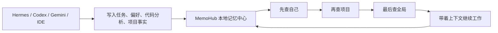

<p align="center">
  
</p>

<p align="center">
  <strong>把 AI 的临时上下文，变成你自己的长期记忆资产。</strong>
</p>

<p align="center">
  <a href="README.md">English</a>
  ·
  <a href="README_CN.md">中文</a>
</p>

<p align="center">
  <a href="docs/guides/quickstart.md">快速开始</a>
  ·
  <a href="docs/integration/access-scenarios.md">真实场景</a>
  ·
  <a href="docs/integration/mcp-integration.md">MCP 接入</a>
  ·
  <a href="skills/memohub/SKILL.md">Agent Skill</a>
  ·
  <a href="docs/README.md">文档中心</a>
</p>

<p align="center">
  
  
  
  
</p>

## 为什么需要 MemoHub

AI Agent 越来越强，但它们的记忆经常被锁在单次对话、单个 IDE、单个工具或某个临时 session 里。换一个 Agent，项目背景要重新解释；切一个工具，代码上下文要重新读取；用户澄清过的事实，下一次还会被问一遍。

MemoHub 要解决的是这个断层：把 Hermes、Codex、Gemini、AI IDE、脚本和外部工具写入的知识，沉淀到一个本地、可追溯、可检索、可治理的统一记忆中心里。

它不是“又一个笔记工具”。它是 AI 的记忆基础设施：私有代码记忆、Agent 永久习惯、项目决策、任务历史、澄清结果和多 Agent 协同上下文，都可以成为你自己的长期资产。

## 一句话理解

MemoHub 让每个 Agent 都有“可带走的长期记忆”：



## 适用场景

- 私有代码记忆检索：像给私有代码库建立自己的 context7，把文件、组件、API、依赖分析和项目习惯写入 `coding_context`，让后续 Agent 不必从零读仓库。
- Hermes 永久记忆和习惯：Hermes 可以记住“我是谁、我常做什么、用户偏好什么、最近处理过哪些任务”，下次接入时直接回到熟悉状态。
- 多 Agent 协同记忆：Codex、Gemini、Hermes、IDE 插件写入同一个项目记忆层，互相继承项目事实、决策和代码上下文。
- Agent 记忆回溯：当你问“Hermes 最近干嘛了”“我现在都在开发什么”“这个项目之前怎么决策的”，MemoHub 能从活动、项目和全局三层召回脉络。
- 冲突澄清写回：对话中确认的事实会沉淀为 curated memory，并参与后续检索，避免同一个问题被反复解释。
- 自发现接入：Agent 读取 `memohub://tools` 即可获得工具、资源、视图、日志和配置入口。

详细流程见：[真实场景接入](docs/integration/access-scenarios.md)。

## 核心能力

| 能力 | 说明 |
| --- | --- |
| 统一记忆对象 | 使用 `CanonicalMemoryEvent`、`MemoryObject`、`ContextView` 组织所有来源的数据。 |
| 分层检索 | 默认遵循“先查自己，再查项目，再查全局”，适合 Agent 身份、项目上下文和全局知识共存。 |
| 私有代码记忆 | 将文件、组件、API、依赖、约定和代码分析沉淀到 `coding_context`。 |
| 多 Agent 协同 | Hermes、Codex、Gemini、IDE 插件可以共享同一项目记忆层。 |
| 澄清写回 | 用户在对话中确认的事实会写回 curated memory，后续 Agent 可直接继承。 |
| MCP 自发现 | Agent 读取 `memohub://tools` 即可知道当前机器支持哪些工具、资源、视图和配置入口。 |

## 工具的作用

| 你想做什么 | 用什么 | 价值 |
| --- | --- | --- |
| 让 Agent 记住事实 | `memohub add` / `memohub_ingest_event` | 把一次对话里的结论变成长期资产。 |
| 查询 Agent 自己 | `agent_profile` | Hermes 能知道自己的习惯、偏好和长期规则。 |
| 回溯近期工作 | `recent_activity` | 直接回答“最近做了什么、谁参与过”。 |
| 读取项目背景 | `project_context` | 换 Agent 不丢项目决策和业务上下文。 |
| 读取代码上下文 | `coding_context` | 私有仓库拥有自己的代码记忆层。 |
| 写回澄清 | `resolve-clarification` / `memohub_resolve_clarification` | 用户确认过的事实不再反复解释。 |
| 让 Agent 自己接入 | `memohub://tools` / Skill | Agent 能发现工具、资源、视图和配置方式。 |

## 业务链路

```text
Agent / IDE / CLI
  -> memohub serve 启动 MCP
  -> 读取 memohub://tools 发现能力
  -> 查询 agent_profile / recent_activity / project_context / coding_context
  -> 带着召回上下文执行任务
  -> 通过 memohub_ingest_event 写入新事实、任务结果、代码分析和用户偏好
  -> 通过 memohub_resolve_clarification 写回用户澄清
  -> 后续 Hermes / Codex / Gemini / IDE 继续读取同一份记忆资产
```

对 Hermes 来说，MemoHub 不是普通工具列表，而是它的长期记忆中心：启动任务前先查询“我是谁、我习惯怎么做、最近做了什么”；任务结束后把新的决策、偏好和澄清写回。对 Codex 和 IDE 来说，它是私有代码上下文层：把仓库理解沉淀下来，后续切换工具也能继承。

## 身份绑定

每个接入渠道都应使用稳定身份，保证记忆可追溯、可聚合、可回溯：

- `actorId`: 当前使用记忆的 Agent 身份，例如 `hermes`、`codex`、`gemini`、`vscode`。
- `source`: 写入来源，例如 `hermes`、`codex`、`vscode`、`scanner`。
- `channel`: 来源通道或会话，例如 `hermes:session:2026-04-29`、`vscode:workspace:memo-hub`。
- `projectId`: 项目边界，例如 `memo-hub`。
- `sessionId/taskId`: 可选，用于把一次任务、一次会话或一次 IDE 操作串起来。

建议命名规则：`<agent-or-tool>:<scope>:<stable-name>`。例如 `hermes:agent:default`、`codex:session:2026-04-29-docs`、`vscode:workspace:memo-hub`。这样 Hermes 能查“我自己的长期习惯”，项目能查“所有 Agent 的协同记忆”，用户也能回溯“某次任务是谁写入的、为什么写入”。

## 5 分钟启动

```bash
bun install
bun run build
bun run verify:cli
```

本地全局注册 CLI：

```bash
bun run link:cli
memohub --help
```

启动 MCP：

```bash
memohub config-check
memohub mcp-doctor
memohub serve
```

Agent 接入后先读取：

```text
memohub://tools
```

然后按任务选择：

- `agent_profile`: 我是谁、我的习惯是什么。
- `recent_activity`: 最近做了什么。
- `project_context`: 当前项目背景、决策和约定。
- `coding_context`: 私有代码记忆、组件、API 和依赖关系。

## 验证一条完整链路

1. 写入一条项目记忆：

```bash
memohub add "MemoHub 是本地 AI 记忆资产中心" --project memo-hub --source cli --category positioning
```

2. 查询项目上下文：

```bash
memohub query "MemoHub 的定位是什么" --view project_context --actor hermes --project memo-hub
```

3. 写入一条私有代码记忆：

```bash
memohub add "apps/cli/src/interface-metadata.ts 是 CLI/MCP 能力目录的生成源" --project memo-hub --source codex --file apps/cli/src/interface-metadata.ts --category private-code-memory
```

4. 查询代码上下文：

```bash
memohub query "CLI/MCP 能力目录的生成源在哪里" --view coding_context --actor codex --project memo-hub
```

5. 验证 MCP 能被 Agent 发现：

```bash
memohub mcp-tools
memohub mcp-doctor
```

6. 让 Agent 接入后读取：

```text
memohub://tools
```

完成这条链路后，就已经验证了 MemoHub 的核心价值：写入长期记忆、按项目查询、按代码查询、让 MCP Agent 自发现可用工具。

## CLI 常用命令

```bash
memohub inspect
memohub add "MemoHub 使用统一记忆中枢" --project memo-hub --source cli --category architecture
memohub query "当前项目上下文" --view project_context --actor hermes --project memo-hub
memohub summarize "近期活动文本" --agent hermes
memohub clarify "项目约定存在冲突" --agent hermes
memohub resolve-clarification clarify_op_1 "以新架构为准" --agent hermes --project memo-hub
memohub config
memohub config-check
memohub mcp-tools
memohub mcp-doctor
memohub serve
```

## MCP 能力

推荐工具：

- `memohub_ingest_event`
- `memohub_query`
- `memohub_summarize`
- `memohub_clarify`
- `memohub_resolve_clarification`
- `memohub_config_get`
- `memohub_config_set`
- `memohub_config_manage`

推荐资源：

- `memohub://tools`
- `memohub://stats`

Agent 接入前建议先读取 `memohub://tools`，获取当前工具列表、资源列表、视图、层级、操作和日志路径。

## Agent Skill

MemoHub 提供仓库根目录 Skill，目标是让 Agent 自己读懂并完成接入：

```bash
bun run skill:memohub
npx skills add <repo> --skill memohub
```

Skill 会告诉 Agent：

- MemoHub 是自己的本地记忆资产中心。
- 启动后先读取 `memohub://tools`。
- Hermes 应先查 `agent_profile` 和 `recent_activity`。
- Codex/IDE 应先查 `project_context` 和 `coding_context`。
- 有价值的新事实、代码分析、用户偏好和澄清必须写回。

## 构建与发布流程

根目录只保留聚合命令：

```bash
bun run build
bun run build:cli
bun run verify:cli
bun run link:cli
bun run skill:memohub
bun run check:release
```

CLI 包内维护自己的构建和 bin 准备逻辑：

```bash
cd apps/cli
bun run build
bun run verify:bin
bun run link:global
```

CLI 正式产物为 `apps/cli/dist/index.js`，`bin.memohub` 指向 `dist/index.js`。

## 接入前检查

```bash
memohub config
memohub config-check
memohub mcp-config
memohub mcp-tools
memohub mcp-doctor
memohub mcp-status
```

若默认日志路径无权限，可临时覆盖：

```bash
MEMOHUB_MCP__LOG_PATH=/tmp/memohub-mcp.ndjson memohub mcp-doctor
```

## 文档入口

- [文档中心](docs/README.md)
- [Changelog](docs/CHANGELOG.md)
- [AI 协作入口](AGENTS.md)
- [接入前检查清单](docs/integration/preflight-checklist.md)
- [接入场景验证](docs/integration/access-scenarios.md)
- [CLI 集成](docs/integration/cli-integration.md)
- [MCP 集成](docs/integration/mcp-integration.md)
- [Agent Skill](skills/memohub/SKILL.md)
- [当前状态](docs/development/current-status.md)
- [新架构业务链路](docs/architecture/business-workflows.md)

## 授权协议

MemoHub 开放源码供学习、研究、个人使用和其他非商业用途使用。未经版权持有人提前书面许可，不允许商业使用。

详情见 [LICENSE](LICENSE)。如需商业授权，请在使用前联系项目所有者。

## AI 工具入口

仓库只维护一份 AI 协作文档：[AGENTS.md](AGENTS.md)。

以下文件均为不同 Agent 工具的入口软链接，内容来源相同：

- `AGENT.md`
- `CLAUDE.md`
- `GEMINI.md`
- `CODEX.md`
- `TRAE.md`
