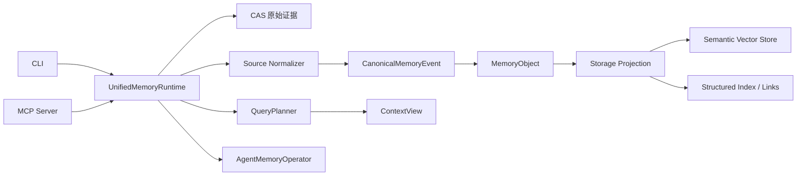
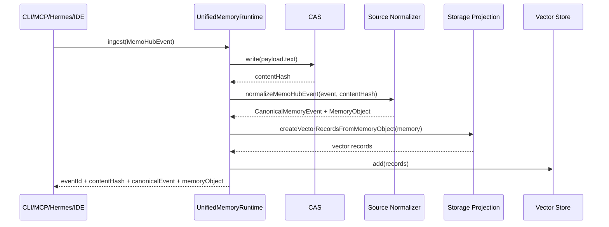
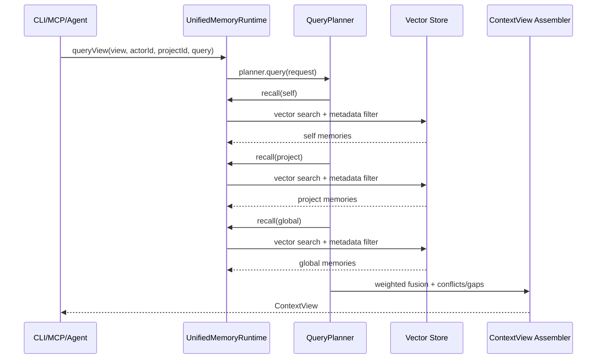
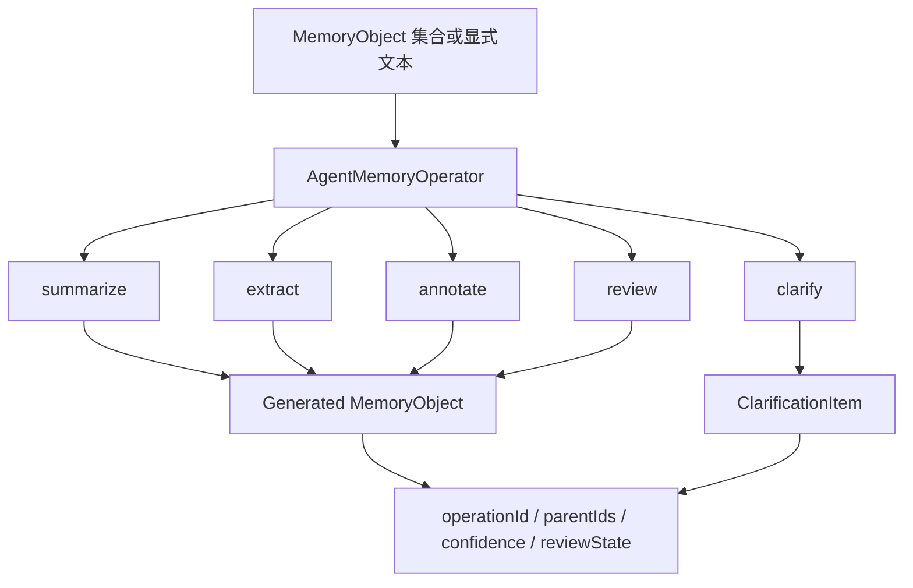
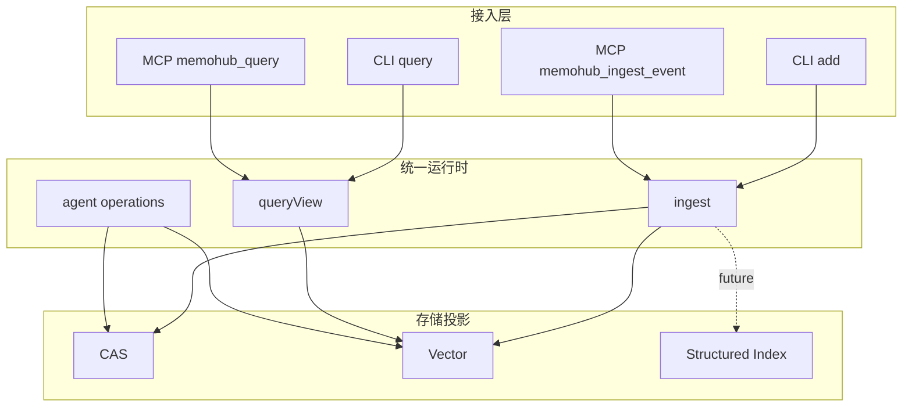

# MemoHub 新架构业务链路

最后更新：2026-04-29

本文档描述当前实现后的业务链路、数据流和组件边界。业务链路以 `UnifiedMemoryRuntime` 为核心，CLI/MCP 只进入标准事件、命名视图、Agent 操作和配置管理入口。

## 总览

## 写入链路

关键规则：

- 原始证据先写 CAS，后续投影必须可追溯到 `contentHash`。
- 所有来源统一归一成 `CanonicalMemoryEvent` 和 `MemoryObject`。
- `source` 是开放 descriptor，Gemini、scanner、browser extension 等新来源不需要改协议枚举。
- CLI/MCP 只接收标准事件、命名视图和配置操作。
- `file_path`、`category`、`tags`、`metadata` 是统一记忆内容和来源元数据，不是轨道选择。

## 查询链路

支持的命名视图：

- `agent_profile`: Agent 习惯、偏好、长期画像。
- `recent_activity`: 最近任务、会话、执行活动。
- `project_context`: 项目事实、决策、业务上下文、约定。
- `coding_context`: 代码记忆、文件、符号、依赖、API 与项目知识。

返回结构固定包含：

- `selfContext`
- `projectContext`
- `globalContext`
- `conflictsOrGaps`
- `sources`
- `metadata.policyId`
- `scoreBreakdown`

## Agent 操作链路

当前 CLI/MCP 暴露：

- `summarize`: 创建总结候选，默认 `reviewState=proposed`。
- `clarify`: 创建澄清项，用于冲突或缺口治理。

核心层已定义但未全部暴露为 CLI/MCP 命令：

- `extract`
- `annotate`
- `review`

## 接入层边界

边界约束：

- CLI 和 MCP 功能保持一致，只是协议形态不同。
- CLI/MCP 不直接构造 `Text2MemInstruction`。
- CLI/MCP 不调用 `MemoryKernel.dispatch()`。
- CLI/MCP 不把内部处理切片注册为对外入口。

## 已验证链路

验证覆盖：

- CLI/MCP 共享事件构造。
- MCP ingest 返回 canonical event 和 memory object。
- MCP query 通过命名 view 表达查询意图。
- `UnifiedMemoryRuntime` 写入后会生成 CAS hash、canonical event、memory object、vector projection。
- `UnifiedMemoryRuntime.queryView()` 可通过 `QueryPlanner` 召回 project context。
- `check:release` 覆盖 build、typecheck、unit、integration/e2e、docs、benchmarks。
