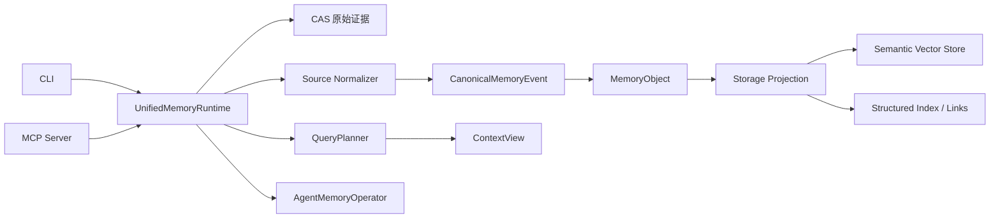
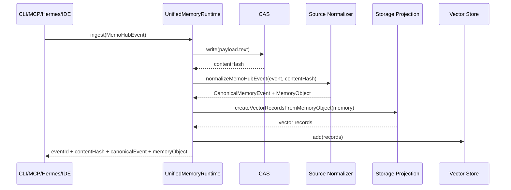
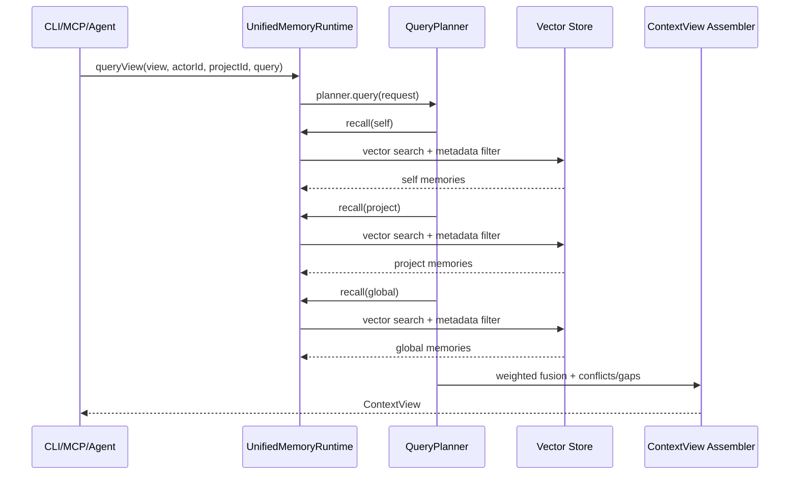
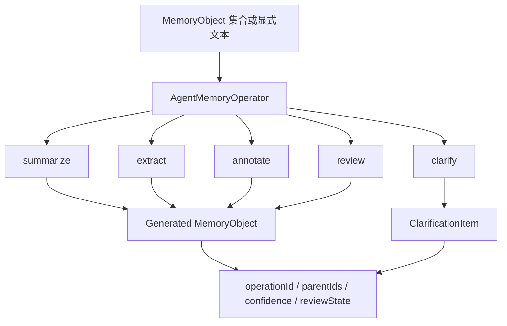
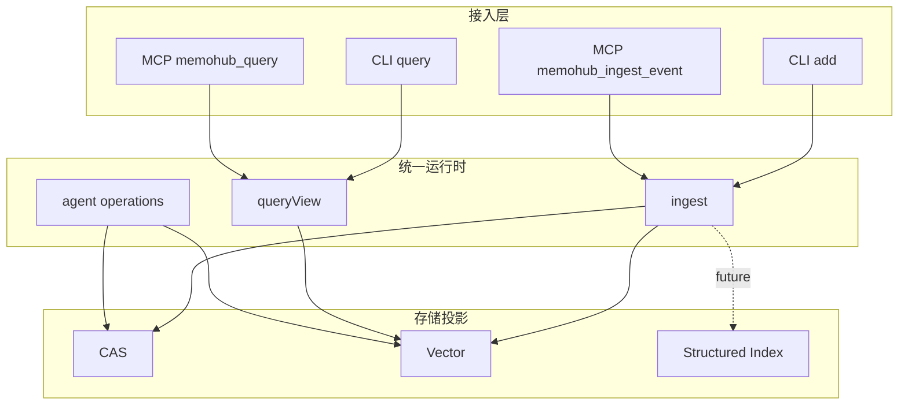

# MemoHub 业务链路与治理规则

最后更新：2026-04-30

本文档是 MemoHub 当前业务链路、治理视角、上下文绑定和接入规则的正式定义。后续 CLI、MCP、Skill、Hermes、IDE 和其他 adapter 接入，都必须以本文档为准，不再各自扩散一套概念。

MemoHub 的目标不是做单一存储系统，而是做多 AI 场景下的统一记忆中枢，用于沉淀可治理、可追溯、可澄清、可共享的记忆资产。

## 目标与范围

MemoHub 当前统一管理以下几类资产：

- Agent 长期记忆：习惯、偏好、近期活动、历史任务。
- 项目知识：业务事实、架构决策、组件职责、项目约定。
- 代码上下文：文件、组件、依赖、API、符号和代码分析结果。
- 任务脉络：会话、任务、工作流节点、阶段性总结。
- 澄清结果：冲突记忆、修正结论、澄清闭环结果。

MemoHub 当前不把 `channel` 当作共享边界，也不把旧 `track` 概念作为产品主概念。共享、可见性和治理边界都应通过统一对象模型表达。

## 治理视角

MemoHub 固定支持三种治理视角：

- `actor` 视角：面向单一主体的自记忆、自查询、自治理，例如 Hermes 查询自己的习惯、最近活动和自有渠道。
- `project` 视角：面向同一项目下的混合上下文整合，允许聚合同项目不同 actor 的沉淀，例如 Hermes、Codex、Gemini 在 `memo-hub` 项目中的共同知识和代码分析。
- `global` 视角：面向全局记忆资产和系统治理，用于查看全部项目、全部 actor、全部渠道的状态，进行冲突检查、测试清理、归档恢复和审计。

规则：

- 记忆归属默认挂在 `actorId`。
- `project` 和 `global` 视角允许跨 actor 聚合，但不得丢失原始来源和责任链路。
- 查询默认遵循 `self -> project -> global`。

## 核心对象与绑定模型

MemoHub 把字段分成四层：

### 1. 归属主体层

- `actorId`：记忆归属主体，也是默认治理主体，例如 `hermes`、`codex`、`gemini`、`vscode`。
- `agentId`：执行实例或 profile，用于细分同一主体的不同执行者，不是默认治理主入口。

### 2. 运行挂载层

- `channelId`：当前运行挂载对象，用于写入继承、渠道治理、状态管理和清理。
- `sessionId`：当前会话。
- `source`：当前接入来源，例如 `hermes`、`cli`、`vscode`、`gitlab-adapter`。

### 3. 上下文绑定层

- `projectId`
- `projectName`
- `workspaceId`
- `repoId`
- `repoRemote`
- `branch`
- `commitSha`
- `taskId`
- `workflowType`
- `filePath`
- `repoRelativePath`

### 4. 治理状态层

- `clarificationState`
- `compressionState`
- `visibility`
- `scope`
- `status`
- `confidence`
- `sourceType`
- `traceId`

约束：

- 写入时应尽可能同时提供归属主体层和上下文绑定层。
- 代码相关写入应尽可能补充 `repo/branch/file`。
- 查询结果必须保留来源 actor、项目、渠道、时间和状态。

## 总览



## 标准业务链路

MemoHub 统一采用以下业务链路：

```text
1. 接入方声明身份和上下文
2. 打开或恢复 channel 挂载
3. 写入统一事件
4. 核心层归一、存储、投影
5. 查询按 actor -> project -> global 召回
6. 冲突通过 clarification / resolution 闭环处理
7. 排障与验证通过 channel / logs / data 入口完成
```

该链路适用于 CLI、MCP、Hermes、IDE 和后续 adapter。

## 写入链路



关键规则：

- 原始证据先写 CAS，后续投影必须可追溯到 `contentHash`。
- 所有来源统一归一成 `CanonicalMemoryEvent` 和 `MemoryObject`。
- `source` 是开放 descriptor，Gemini、scanner、browser extension 等新来源不需要改协议枚举。
- CLI/MCP 只接收标准事件、命名视图和配置操作。
- `file_path`、`category`、`tags`、`metadata` 是统一记忆内容和来源元数据，不是轨道选择。
- 任何写入都必须显式挂载 `channelId`，或继承当前已绑定 channel。
- 不允许无挂载自由写入，否则后续无法可靠治理、追溯和清理。
- 测试写入统一使用 `purpose=test`，避免污染长期记忆资产。

## 查询链路



支持的命名视图：

- `agent_profile`: Agent 习惯、偏好、长期画像。
- `recent_activity`: 最近任务、会话、执行活动。
- `project_context`: 项目事实、决策、业务上下文、约定。
- `coding_context`: 代码记忆、文件、符号、依赖、API 与项目知识。

返回结构固定包含：

- `selfContext`
- `projectContext`
- `globalContext`
- `conflictsOrGaps`
- `sources`
- `metadata.policyId`
- `scoreBreakdown`

查询规则：

- `actor` 视角默认查询自己，再补项目，再补全局。
- `project` 视角允许聚合同项目多 actor 的沉淀，但必须显示来源。
- `global` 视角用于全局资产检索和治理，不改变原始归属。
- 查询结果中如果存在冲突、缺口或低可信度结论，必须通过 `conflictsOrGaps` 暴露出来。

## Agent 操作链路



当前 CLI/MCP 暴露：

- `summarize`: 创建总结候选，默认 `reviewState=proposed`。
- `clarify`: 创建澄清项，用于冲突或缺口治理。

核心层已定义但未全部暴露为 CLI/MCP 命令：

- `extract`
- `annotate`
- `review`

治理规则：

- 记忆允许冲突存在，但不能无痕覆盖。
- 用户澄清、人工纠正、项目约定修正都应进入 `clarification -> resolution` 闭环。
- 后续查询应优先返回已澄清后的有效结论，同时保留历史痕迹。

## 接入层边界



边界约束：

- CLI 和 MCP 功能保持一致，只是协议形态不同。
- CLI/MCP 不直接构造 `Text2MemInstruction`。
- CLI/MCP 不调用 `MemoryKernel.dispatch()`。
- CLI/MCP 不把内部处理切片注册为对外入口。
- Hermes、IDE、adapter、批量导入器都属于接入层，不得绕过统一写入链路直接操作底层存储。
- 新接入方必须先对齐身份模型、channel 挂载规则和上下文绑定规则，再进入正式写入。

## 典型场景

### Hermes 自记忆

- Hermes 先以 `actorId=hermes` 查询 `agent_profile` 和 `recent_activity`。
- 然后在当前项目下查询 `project_context` 和 `coding_context`。
- Hermes 通过这套链路回看自己的习惯、近期任务和项目上下文。

### 多 Agent 项目协同

- Codex、Hermes、Gemini 在同一 `projectId` 下写入不同类型的记忆。
- `project` 视角统一聚合这些记忆。
- 查询时保留每条结论的来源 actor 和上下文绑定。

### 私有代码记忆

- 代码扫描、AST 提取、依赖分析、组件分析结果写入 `coding_context`。
- 写入时必须尽可能带上 `repo/branch/file/task`。
- 后续 Hermes、IDE、Codex 可以复用这些代码知识，而不要求每个入口都重新全量理解仓库。

### 对话澄清写回

- 用户在对话中修正旧结论。
- 系统创建澄清项并写回修正结果。
- 后续查询优先引用修正后的结论，不再把旧结论当作默认事实。

### 首次接入验证

- 首次接入先打开主 channel 或测试 channel。
- 写入测试记忆后立即查询验证。
- 通过 `logs`、`data status`、`data clean --dry-run` 排查和治理。
- 测试验证结束后，优先按 `purpose=test` 做定向清理，而不是直接清空全部数据。

## 治理规则

MemoHub 当前固定遵守以下规则：

- 记忆归属默认挂 `actorId`，而不是挂在 `channelId` 或执行实例上。
- `agentId` 只用于细分实例，不是默认治理主入口。
- `channelId` 和 `sessionId` 是运行挂载，不是共享边界。
- 共享边界和可见性由 `scope` / `visibility` 控制。
- 查询默认顺序为 `self -> project -> global`。
- 同一项目允许跨 actor 聚合治理和检索，但必须保留来源和责任链路。
- 写入必须显式挂载 channel，或继承当前已绑定 channel。
- 测试写入必须使用 `purpose=test`。
- 清理必须先 dry-run，再确认执行。
- 冲突记忆必须通过澄清闭环治理，不允许直接无痕覆盖。

## 项目规则落点

本文档是完整链路和治理规则定义。

与本文档配套的项目级强规则摘要维护在：

- `AGENTS.md`（仓库根目录唯一 AI 协作入口）

其他集成文档只允许复用本文档的术语和规则，不应再扩散独立概念体系。

## 已验证链路

验证覆盖：

- CLI/MCP 共享事件构造。
- MCP ingest 返回 canonical event 和 memory object。
- MCP query 通过命名 view 表达查询意图。
- `UnifiedMemoryRuntime` 写入后会生成 CAS hash、canonical event、memory object、vector projection。
- `UnifiedMemoryRuntime.queryView()` 可通过 `QueryPlanner` 召回 project context。
- `check:release` 覆盖 build、typecheck、unit、integration/e2e、docs、benchmarks。
