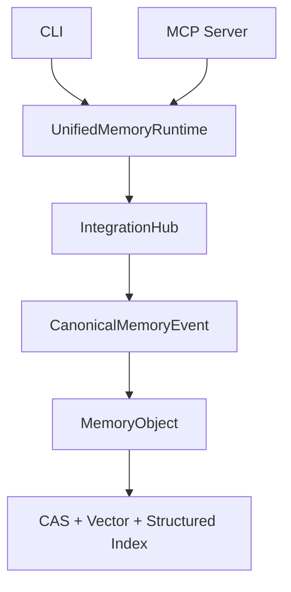

# Integration Hub 澄清链路

最后更新：2026-04-29

Integration Hub 的职责是把外部来源写入统一归一为 `CanonicalMemoryEvent`，再投影为可治理、可检索的 `MemoryObject`。

## 入口关系



CLI 和 MCP 使用同一条业务链路：

- CLI `memohub add` 会构造标准事件并进入统一运行时。
- MCP `memohub_ingest_event` 接收外部标准事件并进入统一运行时。
- 两者最终都会生成 `MemoryObject` 和可检索投影。

## 为什么需要 Integration Hub

- 来源归一：Hermes、IDE、Codex、CLI、scanner 等都进入同一事件模型。
- 证据保留：原始内容先形成可审计 evidence。
- 内容去重：通过内容哈希减少重复写入。
- 治理基础：为状态、冲突、澄清和后续摘要提供 provenance。
- 多存储投影：同一记忆可以进入 CAS、向量、结构化索引和未来关系图。

## 澄清写回

外部对话中用户澄清某个记忆时，应调用：

```text
memohub_resolve_clarification
```

写回结果会生成 `curated MemoryObject`，后续 `project_context`、`coding_context` 等视图可以检索到该修正。

## 当前边界

- 入口层只接收标准事件、澄清操作和命名视图查询。
- 需要新增来源时，扩展 source descriptor 或 payload metadata，不新增入口层分支。
