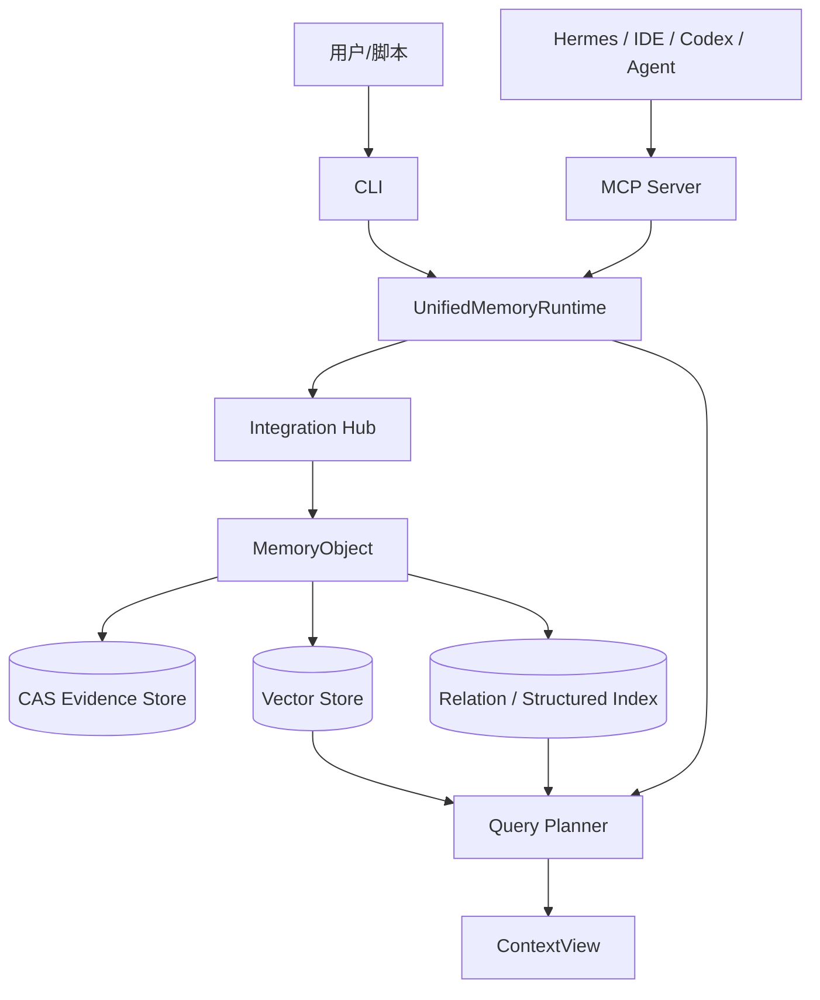
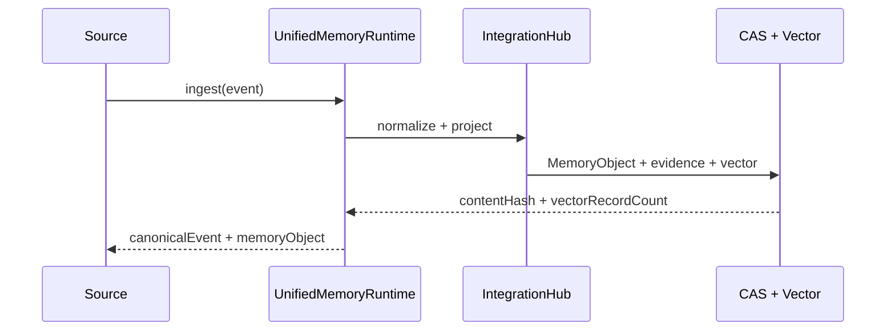
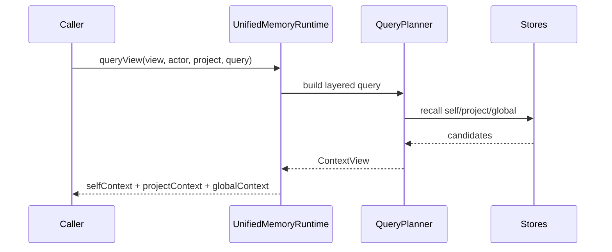
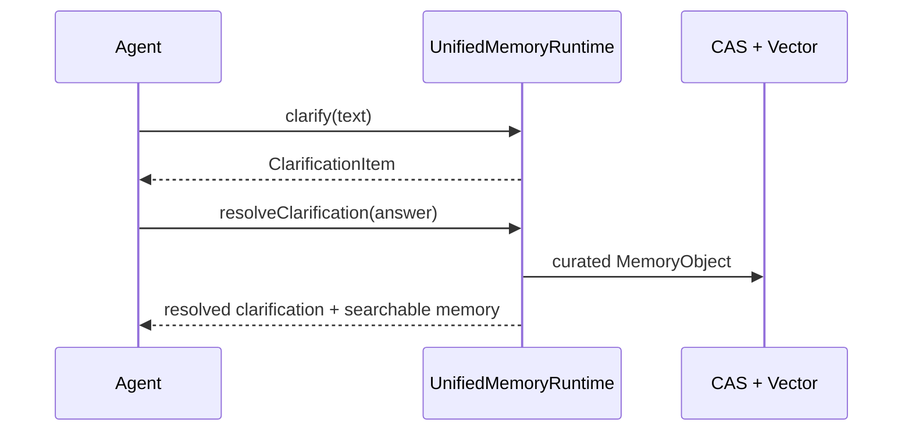

# MemoHub 架构概览

最后更新：2026-04-29

MemoHub 当前架构是统一记忆中枢。外部入口只面向 CLI 和 MCP，内部围绕 `CanonicalMemoryEvent`、`MemoryObject`、命名 `ContextView` 和治理状态运转。

## 总览



## 核心原则

- 所有外部写入先归一成 `CanonicalMemoryEvent`。
- 所有可检索内容落为 `MemoryObject`。
- 查询通过命名视图读取 `self/project/global` 三层上下文。
- 代码、项目知识、任务会话、习惯偏好是 domain/projection，不是对外 API 入口。
- CLI 和 MCP 暴露同等业务能力：写入、查询、总结、澄清、澄清写回、配置管理和状态发现。

## 写入链路



## 查询链路



## 澄清链路



## 对外接口

CLI：

```bash
memohub add "文本" --project memo-hub --source cli
memohub query "问题" --view project_context --actor hermes --project memo-hub
memohub clarification resolve clarify_op_1 "答案" --agent hermes --project memo-hub
memohub config show
memohub mcp tools
memohub mcp serve
```

MCP：

- `memohub_ingest_event`
- `memohub_query`
- `memohub_summarize`
- `memohub_clarification_create`
- `memohub_clarification_resolve`
- `memohub_config_get`
- `memohub_config_set`
- `memohub_config_manage`

资源：

- `memohub://tools`
- `memohub://stats`

## 存储形态

- CAS 保存原始证据和可审计内容。
- Vector Store 支撑语义检索。
- 结构化索引用于代码符号、API、任务和活动等可组织信息。
- 后续关系图用于实体归一、依赖分析、冲突检测和关联查询。

## Agent Skill 接入

仓库根目录生成 `skills/memohub/SKILL.md`：

```bash
bun run skill:memohub
```

Agent 通过 `npx skills add <repo> --skill memohub` 安装后，读取该 skill 完成本地 CLI 构建、配置检查、MCP 启动和工具发现。
