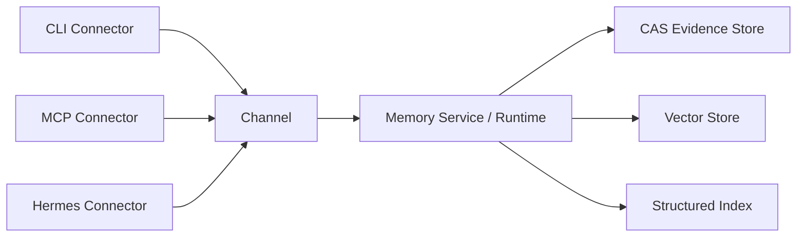
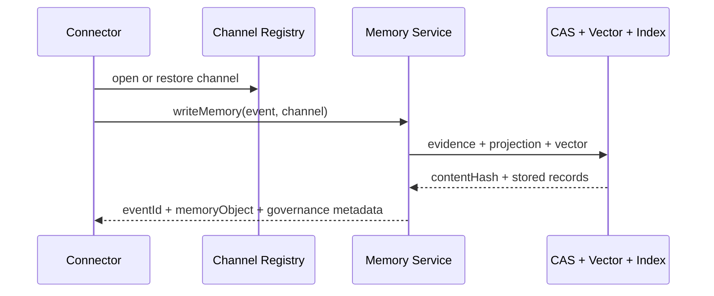
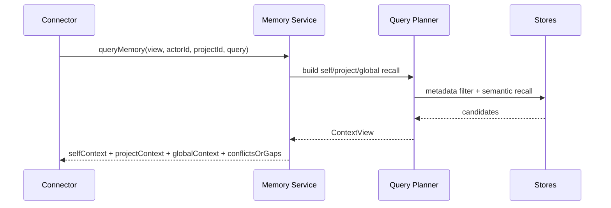
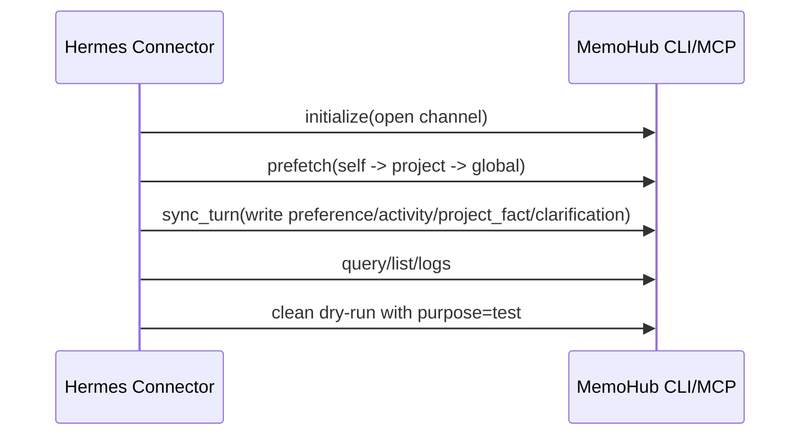

# MemoHub 架构概览

最后更新：2026-05-06

MemoHub 当前正式架构只保留三层业务概念：

```text
Connector -> Channel -> Memory
```

- `Connector`：外部接入形态，例如 CLI、MCP、Hermes 插件、IDE、GitLab。
- `Channel`：身份和上下文挂载，例如 `actorId`、`source`、`projectId`、`sessionId`、`purpose`。
- `Memory`：统一记忆读写与治理入口，负责写入、查询、列表、澄清、日志和清理。

`integration-hub` 仍存在于代码里，但只作为 Memory 内部的事件归一和投影实现细节，不再作为对外产品概念。

## 总览



## 核心原则

- 所有外部输入先归一成 `CanonicalMemoryEvent` 或标准查询请求。
- 所有记忆资产最终落为 `MemoryObject`，并保留来源、归属、时间和上下文绑定。
- 查询默认遵循 `self -> project -> global`。
- `channel` 不是共享边界；共享边界由 `scope`、`visibility`、`actorId`、`projectId` 等字段定义。
- CLI、MCP、Hermes Connector 必须读取同一 Memory service，不得各自维护第二套语义或数据源。

## 写入链路



## 查询链路



## Hermes 纯记忆闭环



第一条闭环的目标不是代码资产层，而是先让 Hermes 在共享 MemoHub 数据源里完成“长期记忆可写、可读、可排障、可清理”的纯记忆闭环。

## 对外接口

CLI：

```bash
memohub add "文本" --project memo-hub --source cli
memohub query "问题" --view project_context --actor hermes --project memo-hub
memohub clarification resolve clarify_op_1 "答案" --actor hermes --project memo-hub
memohub mcp tools
memohub serve
```

MCP：

- `memohub_channel_open`
- `memohub_channel_list`
- `memohub_ingest_event`
- `memohub_query`
- `memohub_list`
- `memohub_logs_query`
- `memohub_clarification_resolve`
- `memohub_data_manage`

资源：

- `memohub://tools`
- `memohub://stats`
