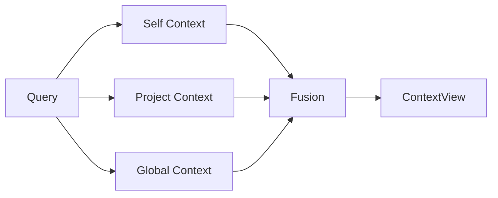

# 检索流水线

最后更新：2026-04-29

MemoHub 当前检索以命名视图和 `self/project/global` 三层召回为核心。

## 查询入口

CLI：

```bash
memohub query "当前项目上下文" --view project_context --actor hermes --project memo-hub
memohub query "MCP 工具注册在哪里" --view coding_context --actor codex --project memo-hub
```

MCP：

```text
memohub_query
```

## 命名视图

- `agent_profile`: 当前 Agent 的习惯、偏好和长期画像。
- `recent_activity`: 近期任务、会话和操作脉络。
- `project_context`: 当前项目知识、决策和业务上下文。
- `coding_context`: 代码结构、组件、API 和依赖相关上下文。

## 三层召回



默认策略：

- 先查自己，再查项目，再查全局。
- 结果保留来源、scope、score 和解释信息。
- archived 状态默认不进入普通检索结果。

## 输出结构

`ContextView` 至少包含：

- `selfContext`
- `projectContext`
- `globalContext`
- `conflictsOrGaps`
- `sources`
- `metadata`

## 后续扩展

- 关系图召回：实体、依赖、API、组件关系。
- 结构化索引：代码符号、文件、任务和会话索引。
- Agent 辅助重排：可选引入 Agent 总结、抽取、备注和澄清。
- 冲突检查：查询时附带可能冲突或缺口。
