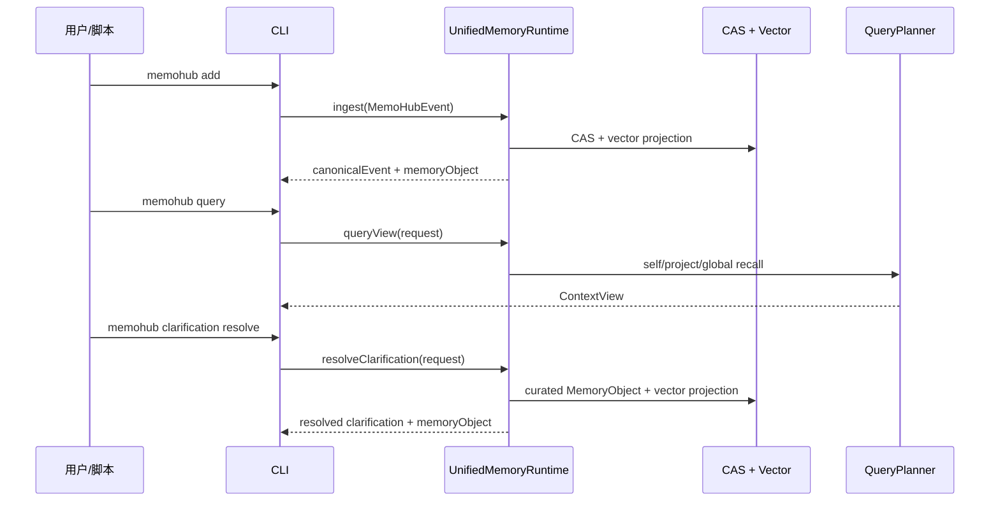

# MemoHub CLI 接入文档

最后更新：2026-04-29

CLI 是统一记忆运行时的本地入口。它与 MCP 暴露相同业务能力：写入、查询、总结、澄清、渠道治理、配置管理和数据治理。

## 命令面

```bash
memohub inspect
memohub add "文本内容" --project memo-hub --source cli --category decision
memohub query "查询文本" --view project_context --actor hermes --project memo-hub
memohub summarize "需要总结的文本" --actor hermes
memohub clarification create "需要澄清的冲突文本" --actor hermes
memohub clarification resolve clarify_op_1 "澄清答案" --actor hermes --project memo-hub
memohub config show
memohub config check
memohub channel open --actor hermes --source hermes --project memo-hub --purpose primary
memohub data status
memohub mcp config
memohub mcp tools
memohub mcp status
memohub mcp doctor
memohub logs query --tail 50
memohub mcp serve
```

全局参数：

- `--lang zh|en`: 覆盖本次输出语言。
- `--json`: 输出机器可读 JSON。

默认人类可读输出使用中文；配置 `system.lang=auto` 时会读取系统语言，无法判断时仍使用中文。

开发态可直接运行源码入口：

```bash
bun apps/cli/src/index.ts inspect
bun apps/cli/src/index.ts add "文本内容" --project memo-hub --source cli
bun apps/cli/src/index.ts query "查询文本" --view coding_context --project memo-hub
bun apps/cli/src/index.ts summarize "近期活动文本" --actor hermes
bun apps/cli/src/index.ts clarification create "冲突文本" --actor hermes
bun apps/cli/src/index.ts clarification resolve clarify_op_1 "澄清答案" --actor hermes --project memo-hub
bun apps/cli/src/index.ts mcp tools
bun apps/cli/src/index.ts serve
```

## CLI 到运行时的数据流



## `add`

写入一条记忆事件。

```bash
memohub add "MemoHub 使用统一记忆运行时" --project memo-hub --source cli --category architecture
```

参数：

- `text`: 必填，记忆文本。
- `--project <projectId>`: 可选，默认 `default`。
- `--source <source>`: 可选，默认 `cli`。
- `--category <category>`: 可选，用于辅助 domain/category 归类。
- `--file <filePath>`: 可选，关联代码文件路径；存在时会进入 `code-intelligence` domain。

输出包含：

- `eventId`
- `contentHash`
- `canonicalEvent`
- `memoryObject`

## `query`

查询命名上下文视图。

```bash
memohub query "Hermes 最近在做什么" --view recent_activity --actor hermes --project memo-hub --limit 5
```

参数：

- `query`: 必填，自然语言查询。
- `--view <view>`: 可选，默认 `project_context`。
- `--actor <actorId>`: 可选，请求方 Agent/Actor。
- `--project <projectId>`: 可选，默认 `default`。
- `--limit <limit>`: 可选，每层结果数量，默认 `5`。

支持视图：

- `agent_profile`
- `recent_activity`
- `project_context`
- `coding_context`

## `summarize`

创建受治理的总结候选。

```bash
memohub summarize "Hermes 最近完成了 CLI/MCP 新链路重构" --actor hermes
```

输出会包含：

- `operationId`
- `inputMemoryIds`
- `outputMemoryIds`
- `confidence`
- `reviewState`
- `provenance.parentIds`

## `clarification create`

创建澄清项。

```bash
memohub clarification create "文档和实现对于查询入口描述不一致，需要用户确认" --actor hermes
```

输出会包含 `ClarificationItem`，用于后续冲突或缺口治理。

## `clarification resolve`

把用户或 Agent 的澄清答案写回为可检索记忆。

```bash
memohub clarification resolve clarify_op_1 "当前以 UnifiedMemoryRuntime 为准" --actor hermes --project memo-hub --memory mem_old_note
```

输出会包含：

- `clarification.status=resolved`
- `memoryObject.state=curated`
- `links.resolves`
- `contentHash`
- `vectorRecordCount`

## `config`

查看新架构解析后的运行时配置。

```bash
memohub config show
```

返回包含：

- 存储路径：`storage.blobPath`、`storage.vectorDbPath`、`storage.vectorTable`
- AI 配置：provider、embedding model、chat model、dimensions
- MCP 配置：transport、logPath、resources
- 记忆能力：query layers、views、operations

## MCP 辅助命令

生成 Agent 可读取的接入配置：

```bash
memohub mcp config
memohub mcp config --target hermes
```

查看 MCP 工具目录：

```bash
memohub mcp tools
```

查看运行时状态和日志：

```bash
memohub mcp status
memohub mcp doctor
memohub logs query --tail 100
```

## 配置读写

读取原始配置值：

```bash
memohub config get mcp.logPath
memohub config get storage.vectorDbPath
```

写入原始配置值：

```bash
memohub config set mcp.logPath '"/tmp/memohub-mcp.ndjson"'
```

注意：`config set` 的 value 会先尝试按 JSON 解析；字符串值建议显式带 JSON 引号。

配置生命周期：

```bash
memohub config check
memohub config uninstall --yes --confirm DELETE_MEMOHUB_CONFIG
memohub data status
memohub data rebuild-schema --yes --confirm DELETE_MEMOHUB_DATA
```

`config check` 会在配置缺失时自动初始化新架构配置。`config uninstall` 直接删除 MemoHub 全局配置片段。

## Agent Skill 生成

```bash
bun run skill:memohub
```

生成结果固定为仓库根目录 `skills/memohub/SKILL.md`，用于后续通过 `npx skills add <repo> --skill memohub` 安装。Agent 读取该 skill 后会执行本地 CLI 构建/链接、配置检查、MCP 启动和工具发现。CLI 不负责写入 `.codex`、`.claude`、`.gemini` 或其他 Agent 私有 skill 目录。

## `inspect`

查看统一运行时能力。

```bash
memohub inspect
```

返回包含：

- `runtime`
- `stores`
- `model`
- `queryLayers`
- `views`
- `agentOperations`

## `serve`

启动 MCP server。

```bash
memohub mcp serve
```

启动别名：

```bash
memohub mcp
```

## 接口合同

CLI 使用当前统一模型字段表达处理意图：

- 写入来源：`source`
- 项目边界：`project`
- 内容分类：`category`
- 代码关联：`file`
- 查询视图：`view`

如需影响处理方式，应通过这些字段表达。

## 相关文档

- [MCP 接入文档](./mcp-integration.md)
- [接入场景验证](./access-scenarios.md)
- [API 参考](../api/reference.md)
- [业务链路](../architecture/business-workflows.md)
- [当前状态](../development/current-status.md)
