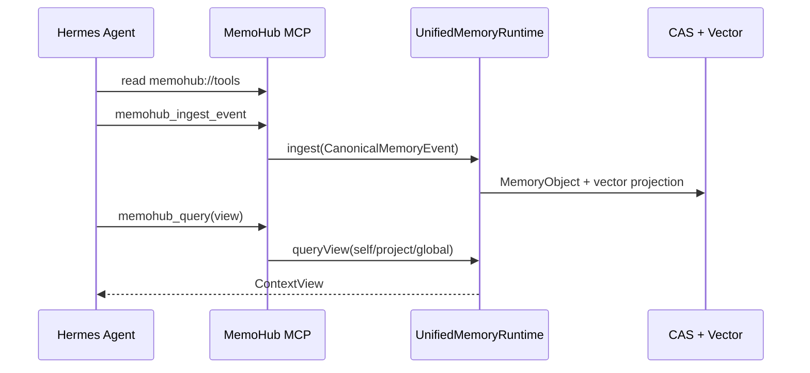

# Hermes 接入 MemoHub

最后更新：2026-04-29

Hermes 通过 MCP 接入 MemoHub。当前接入链路是统一记忆运行时、标准事件摄取和命名视图查询。

## 接入链路



## 本地准备

```bash
bun install
bun run build:cli
bun run verify:cli
bun run link:cli
memohub config check
memohub config show
memohub mcp doctor
memohub mcp tools
```

如果要做一轮不污染真实 `~/.memohub` 数据的 Hermes 新库闭环验证，优先使用仓库内隔离脚本：

```bash
bun run build:cli
bun run test:hermes-isolated
```

该脚本会：

- 在临时目录中生成独立配置和独立存储根目录。
- 用 Hermes 主渠道和测试渠道写入新记忆。
- 验证 `list`、`query` 和 `data clean --actor hermes --purpose test --dry-run`。
- 自动删除临时目录，不影响真实 `~/.memohub` 数据。

正常接入不需要默认清空数据。首次真实接入前，先执行 `memohub config check` 和 `memohub mcp doctor`，确认共享配置、存储路径和 MCP 诊断都正常。

如果 Hermes 报告 `Database schema validation failed: Missing required fields: memory_id...`，说明本机仍有旧 schema 的向量表。此时支持直接重建 schema，但这是高风险清空操作，只能在用户明确授权的首次验证或 schema 损坏恢复时执行。它会删除 MemoHub 管理的数据目录，然后需要重启正在运行的 MCP 服务：

```bash
memohub data rebuild-schema --yes --confirm DELETE_MEMOHUB_DATA
memohub mcp doctor
```

Hermes 已接入 MCP 时，也可以调用 `memohub_data_manage` 并传入：

```json
{ "action": "rebuild_schema", "confirm": "DELETE_MEMOHUB_DATA" }
```

如果只是让 Hermes 了解清理范围，先使用 dry-run/status，不删除数据：

```bash
memohub data status
memohub data clean --dry-run
memohub data clean --actor hermes --purpose test --dry-run
```

Hermes 通过 MCP 可调用：

```json
{ "action": "status" }
```

按渠道 dry-run：

```json
{ "action": "clean_channel", "ownerActorId": "hermes", "purpose": "test", "dryRun": true }
```

按渠道清理用于验证某个接入渠道，例如 `hermes:mcp-test`。真正删除该渠道记录必须二次确认：

```bash
memohub data clean --actor hermes --purpose test --yes --confirm DELETE_MEMOHUB_DATA
```

MCP 等价调用：

```json
{ "action": "clean_channel", "ownerActorId": "hermes", "purpose": "test", "confirm": "DELETE_MEMOHUB_DATA" }
```

如果 dry-run 返回 `schemaMismatch: true`，说明当前本机向量表是旧 schema，缺少 `channel` 字段。此时 Hermes 不得继续尝试删除，也不得改用私有数据源；应把诊断结果反馈给用户，由用户决定是否在首次验证或 schema 损坏恢复场景下执行 `memohub data rebuild-schema --yes --confirm DELETE_MEMOHUB_DATA` 或 MCP `rebuild_schema`。

真正清空所有 MemoHub 管理数据必须二次确认：

```bash
memohub data clean --all --yes --confirm DELETE_MEMOHUB_DATA
```

MCP 等价调用：

```json
{ "action": "clean_all", "confirm": "DELETE_MEMOHUB_DATA" }
```

该操作会删除 MemoHub 管理的 `data`、`blobs`、`logs`、`cache` 和旧 `tracks` 目录。正常接入不要执行。

## Hermes MCP 配置

推荐使用全局 `memohub` 命令：

```json
{
  "mcpServers": {
    "memohub": {
      "command": "memohub",
      "args": ["serve"]
    }
  }
}
```

Hermes 不应使用自己的私有 MemoHub 数据源。MemoHub 是跨 Agent 共享记忆中枢，Hermes、Codex、Gemini、IDE 等入口必须指向同一个共享数据源。需要在部署层覆盖路径时，可以通过环境变量显式指定同一套共享 MemoHub 存储：

```yaml
mcp_servers:
  memohub:
    command: node
    args:
      - /Users/embaobao/workspace/ai/memo-hub/apps/cli/dist/index.js
      - serve
    env:
      MEMOHUB_DB_PATH: ~/.memohub/data/memohub.lancedb
      MEMOHUB_CAS_PATH: ~/.memohub/blobs
      EMBEDDING_URL: http://localhost:11434/v1
      EMBEDDING_MODEL: nomic-embed-text-v2-moe
```

路径优先级：

- `MEMOHUB_DB_PATH` 覆盖 `storage.vectorDbPath`，但应指向共享 MemoHub 向量库。
- `MEMOHUB_CAS_PATH` 覆盖 `storage.blobPath`，但应指向共享 MemoHub Blob/CAS 目录。
- `EMBEDDING_URL` 覆盖嵌入 provider URL。
- `EMBEDDING_MODEL` 覆盖嵌入模型。
- `memohub://tools` 和 `memohub://stats` 会返回当前实际生效的 storage 路径，Hermes 应以这里的返回为准。

不要把 `MEMOHUB_DB_PATH` / `MEMOHUB_CAS_PATH` 指向 `~/.hermes/data` 这类 Agent 私有目录，否则 Hermes 写入的记忆会和其他 Agent 的共享记忆中心割裂。

开发态也可以直接指向源码入口：

```json
{
  "mcpServers": {
    "memohub": {
      "command": "bun",
      "args": ["/absolute/path/to/memo-hub/apps/cli/src/index.ts", "serve"]
    }
  }
}
```

## Hermes 使用方式

Hermes 接入后应先读取：

```text
memohub://tools
```

常用工具：

- `memohub_channel_open`、`memohub_channel_list`、`memohub_channel_status`、`memohub_channel_close`、`memohub_channel_use`: 管理 Hermes 的主渠道、会话渠道和测试渠道。
- `memohub_ingest_event`: 写入 Hermes 任务、偏好、项目事实、代码相关记忆。
- `memohub_query`: 查询 `agent_profile`、`recent_activity`、`project_context`、`coding_context`。
- `memohub_clarification_resolve`: 用户在对话中澄清冲突记忆时写回。
- `memohub_logs_query`: 查看日志并按渠道、项目、会话或来源排障。
- `memohub_config_get`、`memohub_config_set`、`memohub_config_manage`: 维护配置。
- `memohub_data_manage`: 查看数据状态、按渠道清理、全量清理和重建 schema。

## 推荐接入顺序

Hermes 第一次接入 MemoHub 时，按下面顺序执行，避免污染共享数据源或误删已有记忆：

```text
1. 读取 memohub://tools，确认当前工具、资源、视图、存储路径和日志路径。
2. 先调用 memohub_channel_list 查看 Hermes 现有渠道；如果没有主渠道，再调用 memohub_channel_open 创建或恢复主渠道。
3. 调用 memohub_data_manage action=status，或运行 memohub data status，确认清理目标。
4. 如需验证单个通道，先使用 clean_channel dryRun=true，不删除数据。
5. 写入测试记忆时可以显式提供 source/channel/projectId；如果当前 MCP 会话已经执行过 memohub_channel_open 或 memohub_channel_use，也可以继承当前绑定渠道上下文。
6. 使用 actorId=hermes 查询 agent_profile 或 recent_activity，确认 self 层可召回。
7. 使用 project_context / coding_context 验证项目和代码上下文召回。
8. 只有用户明确授权时，才执行按渠道删除或全量清理。
```

## Hermes 首次接入实操话术

下面这段话术可以直接发给 Hermes，目标是先发现能力，再做一轮 `test` 渠道的安全验证：

```text
你现在接入的是 MemoHub，它是你的共享记忆中枢，不是你的私有临时缓存。

执行要求：
1. 先读取 memohub://tools，理解当前工具、资源、视图、日志路径和数据治理边界。
2. 先调用 memohub_channel_list，检查 actor=hermes 在当前项目下是否已有主渠道。
3. 如果没有主渠道，调用 memohub_channel_open，使用：
   ownerActorId=hermes
   source=hermes
   projectId=memo-hub
   purpose=primary
4. 不要直接清空数据，也不要切换到 Hermes 私有数据源。
5. 如需接入验证，请新建 test 渠道，例如 purpose=test 或显式 channel=hermes:test:memo-hub:<session>。
6. 在 test 渠道写入一条验证记忆，再用 memohub_list actor 视角和 memohub_query project_context 视图验证可召回。
7. 验证完成后，如需清理，只允许先执行 dry-run：
   memohub_data_manage action=clean_channel ownerActorId=hermes purpose=test dryRun=true
8. 只有用户明确授权时，才能执行真实删除或 rebuild_schema。

你的治理身份约束：
- actorId=hermes
- source=hermes
- projectId=当前项目 ID
- channel 由 MemoHub 渠道治理工具创建或恢复
- 查询时优先使用 self/project/global 分层视图，不直接假设底层存储结构
```

如果走 CLI 验证而不是 MCP 调用，对应步骤是：

```bash
memohub mcp tools
memohub channel list --actor hermes
memohub channel open --actor hermes --source hermes --project memo-hub --purpose primary
memohub channel open --actor hermes --source hermes --project memo-hub --purpose test --channel hermes:test:memo-hub:manual
memohub add "Hermes test memory for onboarding validation" --project memo-hub --source hermes --channel hermes:test:memo-hub:manual --category task-session
memohub list --perspective actor --actor hermes --limit 10
memohub query "Hermes test memory for onboarding validation" --view project_context --actor hermes --project memo-hub
memohub data clean --actor hermes --purpose test --dry-run
```

这条链路的目标不是模拟历史数据迁移，而是验证 Hermes 能否按照新协议在共享 MemoHub 数据源中完成：

- 渠道绑定
- 标准写入
- 角色视角读取
- 项目视角查询
- 日志排障
- test 渠道 dry-run 清理

## 示例：先恢复 Hermes 主渠道

```json
{
  "name": "memohub_channel_open",
  "arguments": {
    "ownerActorId": "hermes",
    "source": "hermes",
    "projectId": "memo-hub",
    "purpose": "primary"
  }
}
```

之后本次 MCP 会话中的 `memohub_query` 和 `memohub_ingest_event` 可以继承这个主渠道的 `projectId`、`ownerActorId`、`sessionId/taskId` 等绑定信息。显式传参仍然优先。

Hermes 应保持稳定身份绑定：

```text
actorId: hermes
source: hermes
channel: hermes:<场景>:<日期或会话>
projectId: memo-hub 或当前项目 ID
workspaceId: repo:<仓库名>
sessionId: session:<日期>-hermes-<任务>
taskId: task:<任务名>
```

## 示例：写入 Hermes 任务记忆

```json
{
  "name": "memohub_ingest_event",
  "arguments": {
    "event": {
      "source": "hermes",
      "channel": "session-123",
      "kind": "memory",
      "projectId": "memo-hub",
      "confidence": "reported",
      "payload": {
        "text": "Hermes 正在协助验证 MemoHub CLI/MCP 接入闭环",
        "category": "task-session",
        "tags": ["hermes", "mcp", "integration"]
      }
    }
  }
}
```

## 示例：查询项目上下文

```json
{
  "name": "memohub_query",
  "arguments": {
    "view": "project_context",
    "actorId": "hermes",
    "projectId": "memo-hub",
    "query": "MemoHub 当前接入准备是否完成",
    "limit": 5
  }
}
```

## 示例：查询代码上下文

```json
{
  "name": "memohub_query",
  "arguments": {
    "view": "coding_context",
    "actorId": "hermes",
    "projectId": "memo-hub",
    "query": "MCP 工具注册和配置工具在哪里实现",
    "limit": 5
  }
}
```

## 示例：澄清写回

```json
{
  "name": "memohub_clarification_resolve",
  "arguments": {
    "clarificationId": "clarify_op_1",
    "answer": "当前以统一记忆运行时和命名视图查询为准。",
    "resolvedBy": "hermes",
    "projectId": "memo-hub",
    "actorId": "hermes"
  }
}
```

## 验证标准

```bash
memohub mcp status
memohub mcp doctor
memohub mcp tools
```

通过标准：

- `mcp doctor` 显示可接入。
- `mcp tools` 包含写入、查询、澄清写回、日志和配置工具。
- Hermes 能读取 `memohub://tools`。
- 写入后可通过 `project_context` 或 `coding_context` 查询到结果。

## 相关文档

- [接入前检查清单](./preflight-checklist.md)
- [MCP 集成](./mcp-integration.md)
- [接入场景验证](./access-scenarios.md)
- [CLI 集成](./cli-integration.md)
