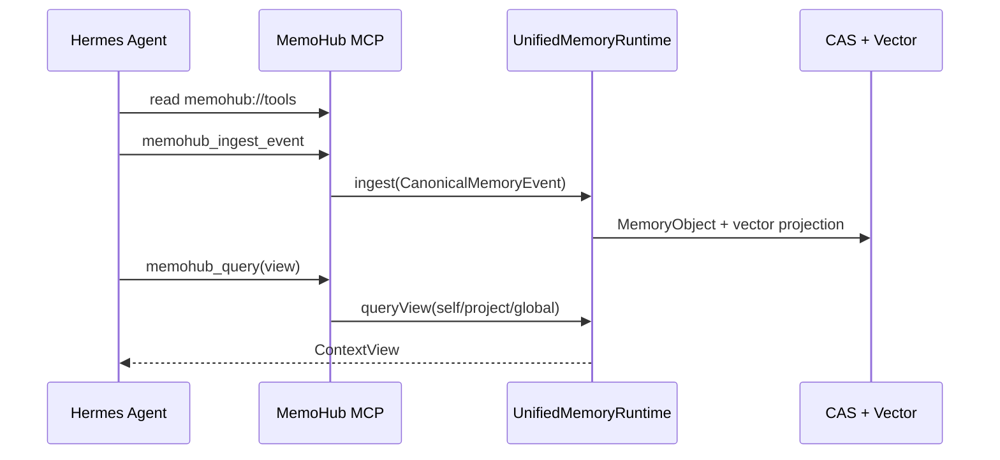

# Hermes 接入 MemoHub

最后更新：2026-04-29

Hermes 通过 MCP 接入 MemoHub。当前接入链路是统一记忆运行时、标准事件摄取和命名视图查询。

## 接入链路



## 本地准备

```bash
bun install
bun run build:cli
bun run verify:cli
bun run link:cli
memohub config-check
memohub mcp-doctor
memohub mcp-tools
```

## Hermes MCP 配置

推荐使用全局 `memohub` 命令：

```json
{
  "mcpServers": {
    "memohub": {
      "command": "memohub",
      "args": ["serve"]
    }
  }
}
```

开发态也可以直接指向源码入口：

```json
{
  "mcpServers": {
    "memohub": {
      "command": "bun",
      "args": ["/absolute/path/to/memo-hub/apps/cli/src/index.ts", "serve"]
    }
  }
}
```

## Hermes 使用方式

Hermes 接入后应先读取：

```text
memohub://tools
```

常用工具：

- `memohub_ingest_event`: 写入 Hermes 任务、偏好、项目事实、代码相关记忆。
- `memohub_query`: 查询 `agent_profile`、`recent_activity`、`project_context`、`coding_context`。
- `memohub_resolve_clarification`: 用户在对话中澄清冲突记忆时写回。
- `memohub_config_get`、`memohub_config_set`、`memohub_config_manage`: 维护配置。

## 示例：写入 Hermes 任务记忆

```json
{
  "name": "memohub_ingest_event",
  "arguments": {
    "event": {
      "source": "hermes",
      "channel": "session-123",
      "kind": "memory",
      "projectId": "memo-hub",
      "confidence": "reported",
      "payload": {
        "text": "Hermes 正在协助验证 MemoHub CLI/MCP 接入闭环",
        "category": "task-session",
        "tags": ["hermes", "mcp", "integration"]
      }
    }
  }
}
```

## 示例：查询项目上下文

```json
{
  "name": "memohub_query",
  "arguments": {
    "view": "project_context",
    "actorId": "hermes",
    "projectId": "memo-hub",
    "query": "MemoHub 当前接入准备是否完成",
    "limit": 5
  }
}
```

## 示例：查询代码上下文

```json
{
  "name": "memohub_query",
  "arguments": {
    "view": "coding_context",
    "actorId": "hermes",
    "projectId": "memo-hub",
    "query": "MCP 工具注册和配置工具在哪里实现",
    "limit": 5
  }
}
```

## 示例：澄清写回

```json
{
  "name": "memohub_resolve_clarification",
  "arguments": {
    "clarificationId": "clarify_op_1",
    "answer": "当前以统一记忆运行时和命名视图查询为准。",
    "resolvedBy": "hermes",
    "projectId": "memo-hub",
    "actorId": "hermes"
  }
}
```

## 验证标准

```bash
memohub mcp-status
memohub mcp-doctor
memohub mcp-tools
```

通过标准：

- `mcp-doctor` 显示可接入。
- `mcp-tools` 包含写入、查询、澄清写回和配置工具。
- Hermes 能读取 `memohub://tools`。
- 写入后可通过 `project_context` 或 `coding_context` 查询到结果。

## 相关文档

- [接入前检查清单](./preflight-checklist.md)
- [MCP 集成](./mcp-integration.md)
- [接入场景验证](./access-scenarios.md)
- [CLI 集成](./cli-integration.md)
