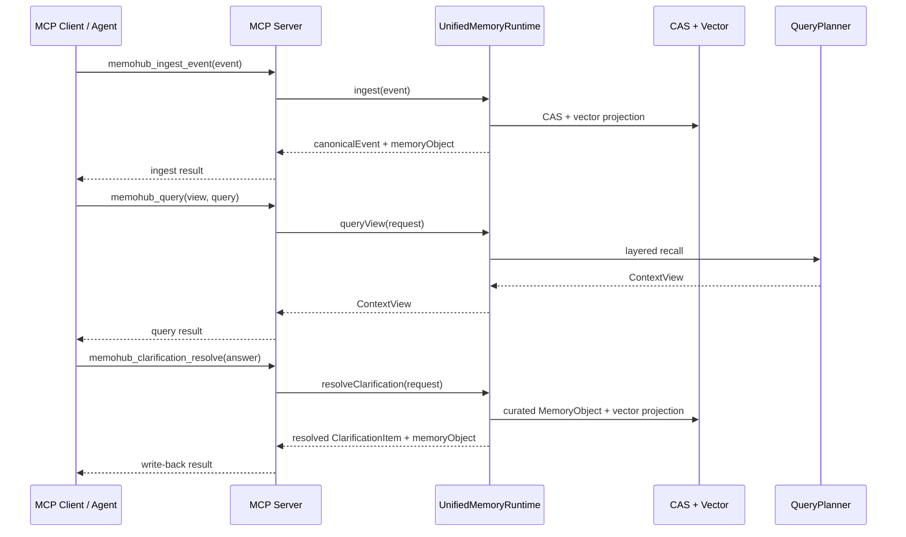

# MemoHub MCP 接入文档

最后更新：2026-04-29

MCP 是统一记忆运行时的标准协议入口。它与 CLI 保持同等业务能力，但使用 MCP tool/resource 形式暴露。

## 快速发现

Agent 接入前可以先通过 CLI 获取当前 MCP 配置和工具目录：

```bash
memohub mcp config
memohub mcp tools
memohub mcp status
memohub mcp doctor
```

开发态：

```bash
bun apps/cli/src/index.ts mcp config --target hermes
bun apps/cli/src/index.ts mcp tools
```

真实 MCP Client 应先读取 `memohub://tools`，再根据工具目录选择写入、查询、总结、澄清或澄清写回工具。推荐顺序是：先 `memohub_channel_list` / `memohub_channel_open` 恢复当前 Agent 或 workspace 的渠道绑定，再执行 `memohub_query` / `memohub_ingest_event`。

## 启动方式

开发态：

```bash
bun apps/cli/src/index.ts serve
```

安装后：

```bash
memohub mcp serve
```

启动别名：

```bash
memohub mcp
```

## Claude Desktop 配置

开发态配置：

```json
{
  "mcpServers": {
    "memohub": {
      "command": "bun",
      "args": [
        "/absolute/path/to/memo-hub/apps/cli/src/index.ts",
        "serve"
      ]
    }
  }
}
```

全局命令配置：

```json
{
  "mcpServers": {
    "memohub": {
      "command": "memohub",
      "args": ["serve"]
    }
  }
}
```

## 工具集合

- `memohub_channel_open`
- `memohub_channel_list`
- `memohub_channel_status`
- `memohub_channel_close`
- `memohub_channel_use`
- `memohub_ingest_event`
- `memohub_query`
- `memohub_summarize`
- `memohub_clarification_create`
- `memohub_clarification_resolve`
- `memohub_logs_query`
- `memohub_config_get`
- `memohub_config_set`
- `memohub_config_manage`
- `memohub_data_manage`

资源：

- `memohub://stats`
- `memohub://tools`

## MCP 到运行时的数据流



## `memohub_ingest_event`

标准事件摄取工具。

```json
{
  "name": "memohub_ingest_event",
  "arguments": {
    "event": {
      "source": "hermes",
      "channel": "session-123",
      "kind": "memory",
      "projectId": "memo-hub",
      "confidence": "reported",
      "payload": {
        "text": "用户偏好 TypeScript",
        "kind": "memory",
        "category": "preference",
        "tags": ["typescript"],
        "metadata": {
          "sourceName": "Hermes"
        }
      }
    }
  }
}
```

如果当前 MCP 会话已经执行过 `memohub_channel_open` 或 `memohub_channel_use`，则 `source`、`channel`、`projectId`、`sessionId`、`taskId` 可以从当前绑定渠道继承。显式传值优先于继承值。

字段说明：

- `source`: 开放来源标识，如 `hermes`、`codex`、`gemini`、`vscode`、`scanner`。
- `channel`: 来源通道，如 session、IDE extension、scanner job。
- `kind`: 当前只支持 `memory`。
- `projectId`: 项目 ID。
- `confidence`: `reported`、`observed`、`inferred`、`provisional`、`verified`。
- `payload.text`: 记忆正文。
- `payload.file_path`: 可选，关联代码文件路径。
- `payload.category`: 可选，分类或 domain hint。
- `payload.tags`: 可选，标签。
- `payload.metadata`: 可选，来源元数据。

返回包含：

- `eventId`
- `contentHash`
- `canonicalEvent`
- `memoryObject`
- `contentLength`

## `memohub_query`

命名视图查询工具。通过 `view` 表达 Agent 想读取的上下文形态。

```json
{
  "name": "memohub_query",
  "arguments": {
    "view": "coding_context",
    "actorId": "hermes",
    "projectId": "memo-hub",
    "workspaceId": "repo:memo-hub",
    "sessionId": "session-123",
    "query": "router 和 MCP query 的关系",
    "limit": 5
  }
}
```

如果当前 MCP 会话已经绑定渠道，则 `actorId`、`projectId`、`workspaceId`、`sessionId`、`taskId` 可以从绑定上下文继承。没有绑定且未显式提供 `projectId` 时，查询会失败并返回清晰错误。

## `memohub_channel_open`

打开或恢复一个受管理渠道绑定。

```json
{
  "name": "memohub_channel_open",
  "arguments": {
    "ownerActorId": "hermes",
    "source": "hermes",
    "projectId": "memo-hub",
    "purpose": "primary"
  }
}
```

长期 Agent 建议显式恢复主渠道；IDE/workspace 来源建议恢复或自动创建 workspace 主渠道。

支持视图：

- `agent_profile`
- `recent_activity`
- `project_context`
- `coding_context`

返回结构：

- `selfContext`
- `projectContext`
- `globalContext`
- `conflictsOrGaps`
- `sources`
- `metadata`

## `memohub_summarize`

显式总结操作。

```json
{
  "name": "memohub_summarize",
  "arguments": {
    "text": "Hermes 最近完成了新架构接入层重构",
    "agentId": "hermes"
  }
}
```

返回 `AgentMemoryOperationResult`，默认 `reviewState=proposed`。

## `memohub_clarification_create`

澄清项生成。

```json
{
  "name": "memohub_clarification_create",
  "arguments": {
    "text": "文档和实现对于查询入口存在冲突",
    "agentId": "hermes"
  }
}
```

返回 `ClarificationItem`，用于后续人工或 Agent 解决冲突。

## `memohub_clarification_resolve`

外部对话中用户澄清某个冲突或缺口时，调用此工具写回答案。写回结果会生成 `curated MemoryObject`，因此后续 `project_context`、`coding_context` 等查询可以读到该修正。

```json
{
  "name": "memohub_clarification_resolve",
  "arguments": {
    "clarificationId": "clarify_op_1",
    "answer": "当前以 UnifiedMemoryRuntime 和命名视图查询为准。",
    "resolvedBy": "hermes",
    "projectId": "memo-hub",
    "actorId": "hermes",
    "memoryIds": ["mem_old_note"]
  }
}
```

返回包含：

- `clarification.status=resolved`
- `clarification.resolution`
- `memoryObject.state=curated`
- `memoryObject.links`，包含 `resolves` 和 `derived_from`
- `contentHash`
- `vectorRecordCount`

## `memohub_stats`

运行时状态资源。

URI：

```text
memohub://stats
```

返回统一运行时状态、视图、工具、资源、存储和日志信息。

## `memohub_tools`

工具目录资源。

URI：

```text
memohub://tools
```

返回：

- 当前 MCP tools 与输入摘要
- 当前 MCP resources
- 支持的 views、layers、operations
- MCP 启动命令和 agent 接入说明
- 存储路径和日志路径

## 状态与日志

CLI 状态命令：

```bash
memohub mcp status
memohub mcp doctor
memohub logs query --tail 100
```

MCP 服务日志为 NDJSON，默认路径来自配置 `mcp.logPath`，默认值为 `~/.memohub/logs/mcp.ndjson`。MCP stdio 服务不会向 stdout 输出启动提示，避免污染 JSON-RPC 协议。

可通过环境变量覆盖：

```bash
MEMOHUB_MCP__LOG_PATH=/tmp/memohub-mcp.ndjson memohub mcp serve
```

## 配置读写

查看解析后的新架构配置：

```bash
memohub config show
memohub config get mcp.logPath
memohub config get storage.vectorDbPath
```

写入配置：

```bash
memohub config set mcp.logPath '"/tmp/memohub-mcp.ndjson"'
memohub config set storage.vectorTable '"memohub"'
```

配置更新后，CLI/MCP 会从 `storage`、`ai`、`mcp`、`memory` 配置节解析运行时。

MCP 也暴露配置工具和数据治理工具，便于 Agent 直接维护接入配置：

- `memohub_config_get`: 不传 `path` 时返回解析后的运行时配置；传 `path` 时读取点分路径。
- `memohub_config_set`: 写入点分路径，value 使用 MCP 结构化值。
- `memohub_config_manage`: 执行 `check`、`uninstall`。
- `memohub_data_manage`: 执行 `status`、`clean_channel`、`clean_all`、`rebuild_schema`。

数据管理动作必须遵守下面的风险边界：

- `status` 只返回清理目标，不删除数据。
- `clean_channel` 用于按渠道验证接入情况，默认应先传 `dryRun=true`。
- `clean_channel` 真删除必须传 `confirm=DELETE_MEMOHUB_DATA`，且只能删除匹配 `channel` 的向量记录。
- `clean_all` 和 `rebuild_schema` 会影响所有 MemoHub 管理数据，只能在用户明确授权时执行。
- 如果 `clean_channel` 返回 `schemaMismatch: true`，说明当前向量表缺少 `channel` 字段。Agent 应停止删除操作，把诊断交给用户，不要改用 Agent 私有数据源。

按渠道 dry-run 示例：

```json
{
  "name": "memohub_data_manage",
  "arguments": {
    "action": "clean_channel",
    "channel": "hermes:mcp-test",
    "dryRun": true
  }
}
```

按渠道删除示例：

```json
{
  "name": "memohub_data_manage",
  "arguments": {
    "action": "clean_channel",
    "channel": "hermes:mcp-test",
    "confirm": "DELETE_MEMOHUB_DATA"
  }
}
```

## Agent Skill

仓库维护根目录 skill 安装源：

```bash
bun run skill:memohub
```

产物固定为 `skills/memohub/SKILL.md`。它用于后续通过 `npx skills add <repo> --skill memohub` 安装；Agent 读取该 skill 后会完成本地 CLI 安装、MCP 配置检查、`memohub mcp serve` 启动和 `memohub://tools` 能力发现。MemoHub 构建脚本不直接写入 `.codex`、`.claude`、`.gemini`、`apps/cli/skills` 或其他本机 Agent 私有目录。

## 接口合同

MCP 入口以 `memohub://tools` 返回的目录为准。Agent 应先读取该资源，再选择写入、查询、总结、澄清、澄清写回或配置工具。

## 相关文档

- [CLI 接入文档](./cli-integration.md)
- [接入场景验证](./access-scenarios.md)
- [API 参考](../api/reference.md)
- [业务链路](../architecture/business-workflows.md)
- [当前状态](../development/current-status.md)
