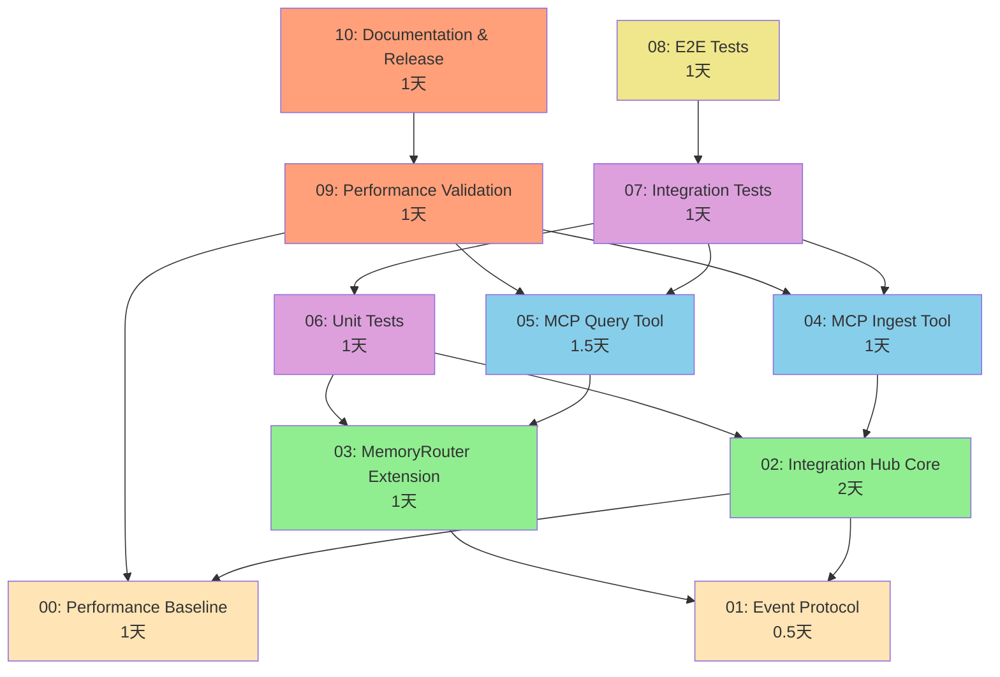

# Phase 0 MVP Implementation Roadmap

## 📊 总览

将 **MCP Integration Hub MVP** 拆分为 **10 个细粒度的、可并行的开发 changes**。

每个 change 都是 **1-2 天**的工作量，可以独立开发和测试。

---

## 🎯 10 个 Changes 总览

| ID | 名称 | 优先级 | 工作量 | 依赖 | 状态 |
|----|------|--------|--------|------|------|
| **00** | Performance Baseline | P0 | 1天 | 无 | ⏸️ 待开始 |
| **01** | Event Protocol | P0 | 0.5天 | 无 | ⏸️ 待开始 |
| **02** | Integration Hub Core | P0 | 2天 | 00, 01 | ⏸️ 待开始 |
| **03** | MemoryRouter Extension | P0 | 1天 | 01 | ⏸️ 待开始 |
| **04** | MCP Ingest Tool | P0 | 1天 | 02 | ⏸️ 待开始 |
| **05** | MCP Query Tool | P0 | 1.5天 | 03 | ⏸️ 待开始 |
| **06** | Unit Tests | P0 | 1天 | 02, 03 | ⏸️ 待开始 |
| **07** | Integration Tests | P0 | 1天 | 04, 05, 06 | ⏸️ 待开始 |
| **08** | E2E Tests | P1 | 1天 | 07 | ⏸️ 待开始 |
| **09** | Performance Validation | P0 | 1天 | 00, 04, 05 | ⏸️ 待开始 |
| **10** | Documentation & Release | P1 | 1天 | 09 | ⏸️ 待开始 |

**总工作量**: 约 **12.5 天**

---

## 📅 实施计划（3 周）

### Week 1: 基础设施和核心功能

#### Day 1-2: 并行开发基础
- **[00] Performance Baseline** (1天) - 建立性能基准
- **[01] Event Protocol** (0.5天) - 定义事件类型

#### Day 3-5: 核心组件
- **[02] Integration Hub Core** (2天) - 核心集成逻辑
- **[03] MemoryRouter Extension** (1天) - 路由扩展

### Week 2: MCP 工具和测试

#### Day 6-7: MCP 工具
- **[04] MCP Ingest Tool** (1天) - 摄取工具
- **[05] MCP Query Tool** (1.5天) - 查询工具

#### Day 8-9: 测试
- **[06] Unit Tests** (1天) - 单元测试
- **[07] Integration Tests** (1天) - 集成测试

#### Day 10: 性能和 E2E
- **[09] Performance Validation** (1天) - 性能验证
- **[08] E2E Tests** (1天) - 端到端测试

### Week 3: 文档和发布

#### Day 11-12: 文档
- **[10] Documentation & Release** (1天) - 文档和发布准备

#### Day 13-15: 缓冲时间
- Code review
- Bug 修复
- 性能优化
- 发布准备

---

## 🔗 依赖关系图



---

## 🚀 并行开发策略

### Wave 1: 基础（Day 1-2）
```
00: Performance Baseline ─┐
                          ├─> 并行开发
01: Event Protocol    ────┘
```

### Wave 2: 核心（Day 3-5）
```
02: Integration Hub Core ─┐
                          ├─> 等待 Wave 1
03: MemoryRouter Extension┘
```

### Wave 3: 工具（Day 6-7）
```
04: MCP Ingest Tool ──────┐
                          ├─> 并行开发
05: MCP Query Tool ───────┘
```

### Wave 4: 测试（Day 8-10）
```
06: Unit Tests ───────────┐
                          │
07: Integration Tests ────┼─> 混合并行
                          │
09: Performance Validation┘

08: E2E Tests ────────────> 等待 07
```

### Wave 5: 发布（Day 11-12）
```
10: Documentation & Release > 等待 09
```

---

## 📋 每个 Change 的详细说明

### 00: Performance Baseline (1天)

**目标**: 建立现有系统的性能基准

**产出**:
- 性能测试脚本 `scripts/benchmark.ts`
- 性能监控模块 `packages/core/src/performance.ts`
- 性能配置 `packages/config/src/performance.ts`
- 基准数据文档 `docs/performance/baseline.md`

**可以立即开始** ✅

---

### 01: Event Protocol (0.5天)

**目标**: 定义外部事件的 TypeScript 类型和验证

**产出**:
- 事件类型 `packages/protocol/src/event.ts`
- 错误类型 `packages/protocol/src/errors.ts`
- zod 验证 schema
- 单元测试

**可以立即开始** ✅

---

### 02: Integration Hub Core (2天)

**目标**: 实现核心集成逻辑

**产出**:
- 新包 `packages/integration-hub/`
- IntegrationHub 主类
- CAS 适配器
- 投影器
- 单元测试

**依赖**: 00, 01

---

### 03: MemoryRouter Extension (1天)

**目标**: 扩展路由器支持 kind-based 路由

**产出**:
- 扩展的 `MemoryRouter` 类
- kind_match 规则类型
- 默认配置
- 单元测试

**依赖**: 01

---

### 04: MCP Ingest Tool (1天)

**目标**: 实现 memohub_ingest_event 工具

**产出**:
- `apps/cli/src/mcp/tools/ingest.ts`
- MCP 工具注册
- 集成测试

**依赖**: 02

---

### 05: MCP Query Tool (1.5天)

**目标**: 实现 memohub_query 统一查询接口

**产出**:
- `apps/cli/src/mcp/tools/query.ts`
- memory 和 coding_context 查询
- 集成测试

**依赖**: 03

---

### 06: Unit Tests (1天)

**目标**: 确保核心组件的单元测试覆盖率

**产出**:
- IntegrationHub 单元测试
- CAS 适配器单元测试
- 投影器单元测试
- MemoryRouter 单元测试
- 覆盖率报告

**依赖**: 02, 03

---

### 07: Integration Tests (1天)

**目标**: 验证组件间的集成

**产出**:
- IntegrationHub → Text2Mem 集成测试
- IntegrationHub → MemoryKernel → Track 集成测试
- MCP → IntegrationHub → Track 集成测试

**依赖**: 04, 05, 06

---

### 08: E2E Tests (1天)

**目标**: 验证完整的用户场景

**产出**:
- Hermes 模拟客户端
- E2E 测试场景
- 往返一致性测试

**依赖**: 07

---

### 09: Performance Validation (1天)

**目标**: 验证性能预算合规

**产出**:
- 性能测试脚本
- CI 性能测试配置
- 性能报告
- 优化记录（如需要）

**依赖**: 00, 04, 05

---

### 10: Documentation & Release (1天)

**目标**: 完成文档和发布准备

**产出**:
- Integration Hub 架构文档
- MemoHubEvent schema 文档
- MCP 工具使用示例
- 迁移指南
- 更新项目文档
- Release notes

**依赖**: 09

---

## ✅ 验收标准

### 功能验收

- [ ] Hermes 可以通过 memohub_ingest_event 写入记忆
- [ ] Hermes 可以通过 memohub_query 检索记忆
- [ ] IDE MCP 客户端可以查询编码上下文
- [ ] 所有写入通过 MemoryKernel.dispatch()
- [ ] CAS 去重正常工作

### 性能验收

- [ ] memohub_ingest_event P99 < BASELINE_ADD + 50ms
- [ ] memohub_query P99 < BASELINE_SEARCH + 100ms
- [ ] 单元测试覆盖率 > 80%

### 集成验收

- [ ] 至少 1 个端到端测试
- [ ] 现有 memohub_add/search 不受影响

---

## 📊 进度追踪

### 总体进度

```
[████████████████████████████████] 0% (0/10)

00: [                    ] 0%
01: [                    ] 0%
02: [                    ] 0%
03: [                    ] 0%
04: [                    ] 0%
05: [                    ] 0%
06: [                    ] 0%
07: [                    ] 0%
08: [                    ] 0%
09: [                    ] 0%
10: [                    ] 0%
```

### 当前阶段

**准备阶段** - 等待开始

### 下一步行动

1. **审查提案**: 团队审查所有 10 个 changes
2. **开始 Wave 1**: 并行开发 00 和 01
3. **每日站会**: 同步进度和阻塞
4. **Code Review**: 每个 change 完成后审查
5. **合并到 main**: 所有 changes 完成后合并

---

## 🎓 开发指南

### 开始一个 Change

1. 阅读 change 的 proposal.md
2. 检查依赖是否满足
3. 创建分支：`git checkout -b change/XX-name`
4. 按照 tasks.md 实施
5. 运行测试：`bun test`
6. 提交 PR：`git push origin change/XX-name`

### 并行开发建议

- 不同开发者可以在不同 changes 上工作
- 确保依赖关系正确
- 及时同步接口变更
- 使用特性分支隔离工作

### 测试策略

```
测试金字塔:
      /\
     /  \    E2E (10%) - Change 08
    /____\
   /      \  集成 (20%) - Change 07
  /________\
 /          \ 单元 (70%) - Change 06
/____________\
```

---

## 📚 相关文档

- [Phase 0 MVP Proposal](../2026-04-28-mcp-integration-hub-mvp/proposal.md)
- [Phase 0 MVP Design](../2026-04-28-mcp-integration-hub-mvp/design.md)
- [Phase 0 MVP Tasks](../2026-04-28-mcp-integration-hub-mvp/tasks.md)

---

**创建日期**: 2026-04-29
**预计完成**: 2026-05-20 (3 周)
**负责团队**: MemoHub 开发团队
