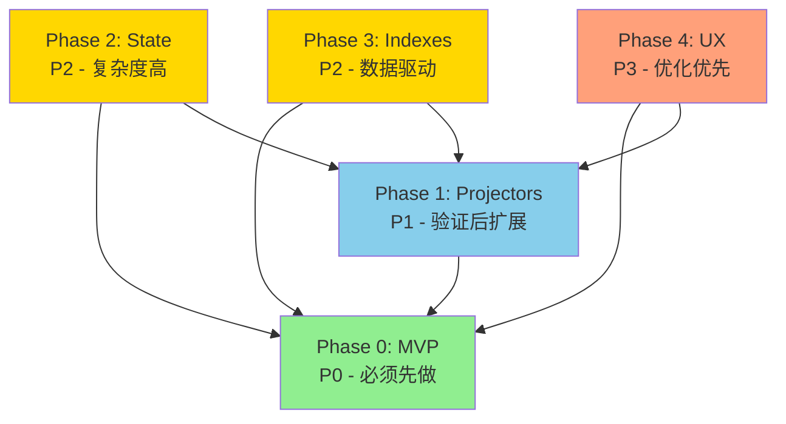

# OpenSpec 提案拆分总结

## 📊 拆分概览

将 **data-stream-integration** 单一大提案拆分为 **5 个渐进式 phases**，遵循"最小可用、数据驱动"原则。

---

## 🎯 拆分策略

### 拆分原则

1. **MVP 优先**: Phase 0 只验证核心路径
2. **依赖明确**: 后续 phases 依赖前置 phases 的验证
3. **数据驱动**: 性能优化和 UX 改进基于实际数据
4. **风险可控**: 每个 phase 都可以独立交付和回滚

---

## 📦 5 个 Phases 详解

### Phase 0: MCP Integration Hub MVP (P0)

**目标**: 验证核心集成路径

**范围**:
- ✅ Integration Hub 基础（验证、CAS 去重）
- ✅ 单一投影器：`memory` → Text2Mem
- ✅ MemoryRouter 扩展（kind-based 路由）
- ✅ 2 个基础 MCP 工具（`ingest_event`, `query`）
- ✅ 完整测试和性能预算

**不包含**:
- ❌ 其他事件类型（repo_analysis, api_capability 等）
- ❌ 多会话状态共享
- ❌ 额外 Soul 索引
- ❌ 便捷 MCP 工具

**依赖**: 无

**优先级**: P0（最高）

**交付物**:
- [proposal.md](./2026-04-28-mcp-integration-hub-mvp/proposal.md)
- [design.md](./2026-04-28-mcp-integration-hub-mvp/design.md)
- [tasks.md](./2026-04-28-mcp-integration-hub-mvp/tasks.md)
- 3 个 specs（integration-hub, memory-router-extension, mcp-tools）

---

### Phase 1: MCP Event Projectors Extension (P1)

**目标**: 扩展事件类型支持

**范围**:
- ✅ repo_analysis 投影器 → track-source
- ✅ api_capability 投影器 → track-source
- ✅ session_state 投影器 → track-stream
- ✅ business_context 投影器 → track-insight
- ✅ habit 投影器 → track-insight

**依赖**: Phase 0 MVP

**优先级**: P1

**交付物**:
- [proposal.md](./2026-04-28-mcp-event-projectors/proposal.md)

---

### Phase 2: Multi-Session State Sharing (P2)

**目标**: 实现多会话状态共享

**范围**:
- ✅ SessionState 读模型
- ✅ 跨会话状态聚合
- ✅ 冲突检测和解决
- ✅ 分 3 个子阶段渐进实现

**子阶段**:
- 2.1: 只读多会话感知
- 2.2: 写时复制 + 后台合并
- 2.3: 实时状态同步

**依赖**: Phase 0, Phase 1

**优先级**: P2

**交付物**:
- [proposal.md](./2026-04-28-multi-session-state/proposal.md)

---

### Phase 3: Structured Indexes for Performance (P2)

**目标**: 基于性能数据添加结构化索引

**范围**:
- ✅ api_capabilities 索引
- ✅ relations 关系图谱
- ✅ habits 索引
- ✅ project_contexts 索引

**条件化实现**:
```typescript
if (performanceMetrics.apiCapabilityQueryTime > 500ms) {
  implementApiCapabilityIndex();
}
```

**依赖**: Phase 0, Phase 1

**优先级**: P2（数据驱动）

**交付物**:
- [proposal.md](./2026-04-28-structured-indexes/proposal.md)

---

### Phase 4: MCP UX Improvements (P3)

**目标**: 基于使用数据优化用户体验

**范围**:
- ✅ 便捷写入工具（`write_memory`, `write_repo_analysis` 等）
- ✅ 便捷查询工具（`read_memory`, `get_session_state` 等）
- ✅ 使用分析和优化

**条件化实现**:
```typescript
if (usageStats.memoryWriteFrequency > 100) {
  implementMemohubWriteMemory();
}
```

**依赖**: Phase 0, Phase 1

**优先级**: P3（数据驱动）

**交付物**:
- [proposal.md](./2026-04-28-mcp-ux-improvements/proposal.md)

---

## 📁 文件结构

```
openspec/changes/
├── 2026-04-28-mcp-integration-hub-mvp/        # Phase 0 (P0)
│   ├── .openspec.yaml
│   ├── proposal.md
│   ├── design.md
│   ├── tasks.md
│   └── specs/
│       ├── integration-hub/spec.md
│       ├── memory-router-extension/spec.md
│       └── mcp-tools/spec.md
│
├── 2026-04-28-mcp-event-projectors/           # Phase 1 (P1)
│   ├── .openspec.yaml
│   └── proposal.md
│
├── 2026-04-28-multi-session-state/            # Phase 2 (P2)
│   ├── .openspec.yaml
│   └── proposal.md
│
├── 2026-04-28-structured-indexes/             # Phase 3 (P2)
│   ├── .openspec.yaml
│   └── proposal.md
│
├── 2026-04-28-mcp-ux-improvements/            # Phase 4 (P3)
│   ├── .openspec.yaml
│   └── proposal.md
│
└── archive/
    └── 2026-04-28-data-stream-integration-original/  # 原始提案
        ├── .openspec.yaml
        ├── proposal.md
        ├── design.md
        ├── tasks.md
        └── specs/
            ├── integration-hub/spec.md
            ├── mcp-knowledge-gateway/spec.md
            ├── hermes-mcp-integration/spec.md
            └── code-business-indexing/spec.md
```

---

## 🔄 依赖关系图



---

## 📊 对比原始提案

| 方面 | 原始提案 | 拆分后 |
|------|----------|--------|
| MCP 工具数量 | 14 个 | Phase 0: 2 个，后续渐进 |
| Soul 索引数量 | 5 个 | Phase 0: 0 个，后续按需 |
| 投影器数量 | 6 个 | Phase 0: 1 个，后续渐进 |
| 性能优化 | 提前假设 | Phase 3 基于数据 |
| 用户体验 | 预设工具 | Phase 4 基于数据 |
| 多会话状态 | 一次性实现 | 分 3 个子阶段 |
| 实施风险 | 高（范围大） | 低（渐进式） |

---

## ✅ 优化收益

### 1. 降低首次实施风险

- **原始**: 一次性实现 14 个工具 + 5 个索引 + 6 个投影器
- **优化**: Phase 0 只实现 2 个工具 + 1 个投影器

### 2. 数据驱动决策

- **原始**: 假设需要索引和便捷工具
- **优化**: Phase 3/4 基于实际数据决定

### 3. 清晰的里程碑

- **原始**: 单一大 change，难以追踪进度
- **优化**: 5 个独立 changes，每个都有明确目标

### 4. 灵活的优先级

- **原始**: 全部 P0（或全部延期）
- **优化**: P0-P3 分级，可按需实施

### 5. 易于回滚

- **原始**: 失败需全部回滚
- **优化**: 单个 phase 失败不影响其他 phases

---

## 🚀 下一步行动

### 立即行动

1. **审查 Phase 0 MVP**: 团队审查 [2026-04-28-mcp-integration-hub-mvp](./2026-04-28-mcp-integration-hub-mvp/)
2. **建立性能基准**: 测量现有 `memohub_add/search` 性能
3. **开始实施**: 按照 tasks.md 顺序实施

### 后续规划

1. **Phase 0 完成** → 部署并收集数据
2. **分析使用数据** → 决定 Phase 1-4 的优先级
3. **渐进式交付** → 每完成一个 phase 部署一次

---

## 📝 Git 提交

```bash
commit ce17089
feat: split data-stream-integration into 5 incremental phases

25 files changed, 1614 insertions(+), 232 deletions(-)

推送至:
- gitee: https://gitee.com/embaobao/memo-hub.git
- github: https://github.com/embaobao/memo-hub.git
```

---

## 📚 相关文档

- [Phase 0 MVP Design](./2026-04-28-mcp-integration-hub-mvp/design.md)
- [Phase 0 MVP Tasks](./2026-04-28-mcp-integration-hub-mvp/tasks.md)
- [原始提案（已归档）](./archive/2026-04-28-data-stream-integration-original/)

---

**拆分日期**: 2026-04-28
**拆分原因**: 原提案范围过大，需要渐进式实现
**核心理念**: 最小可用、数据驱动、风险可控
