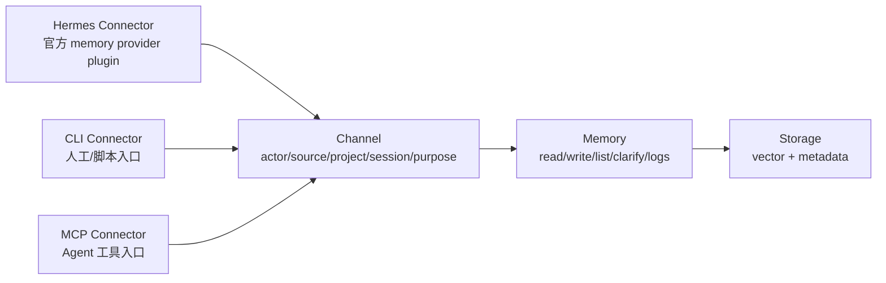

## Overview

本设计只保留三层业务概念：

```text
Connector -> Channel -> Memory
```

- `Connector` 负责把外部工具或 Agent 的生命周期、输入、查询请求接入 MemoHub。
- `Channel` 负责记录这次接入属于谁、来自哪里、在哪个项目、哪个 session、什么 purpose。
- `Memory` 负责统一记忆对象的写入、查询、列表、澄清、日志和治理。

Hermes 是第一个真实 Connector。它通过官方 memory provider plugin 接入，不再额外引入中间业务抽象。CLI 和 MCP 也按 Connector 看待：CLI 是人工/脚本 Connector，MCP 是 Agent 工具协议 Connector。

## Target Architecture



约束：

- Connector 不直接绕过 Channel 写 Memory。
- Channel 不决定共享边界，只负责身份和上下文挂载。
- Memory 的共享边界由 `scope`、`visibility`、`actorId`、`projectId`、`domain` 等字段决定。
- `integration-hub` 作为 Memory 内部事件归一和投影实现细节存在，不再作为接入层概念暴露。

## Directory Plan

### Immediate Layout

```text
connectors/
  hermes/
    pyproject.toml
    uv.lock
    README.md
    memohub_provider/
      __init__.py
      plugin.yaml
      config.py
      client.py
      extractor.py
      formatter.py
      provider.py
    test/
      test_contract.py
      test_memory_loop.py

packages/
  channel/
    src/
      index.ts
      channel-registry.ts
      channel-defaults.ts
      channel-types.ts
    test/
      channel-registry.test.ts
  memory/
    src/
      index.ts
      memory-service.ts
      memory-read.ts
      memory-write.ts
      memory-list.ts
      memory-clarification.ts
      memory-logs.ts
    test/
      memory-loop.test.ts
```

### Short-Term Compatibility Inside Repository

- `apps/cli` 暂时保留，避免一次性移动 CLI 构建和发布链路。
- `apps/cli/src/channel-registry.ts` 的实现迁到 `packages/channel` 后，CLI 只导入新包。
- `apps/cli/src/unified-memory-runtime.ts` 的高层读写逻辑逐步迁到 `packages/memory`，CLI/MCP 只调用 Memory service。
- `packages/integration-hub` 暂时保留为内部实现包，后续视复杂度决定是否合并到 `packages/memory`。
- `packages/storage-flesh`、`packages/storage-soul` 暂时保留为 storage 实现包，不在本变更里做存储层大合并。

### Later Cleanup

```text
connectors/
  cli/
  mcp/
  hermes/
  ide/
  gitlab/
```

CLI/MCP 后续迁移到 `connectors/` 时只改变工程组织，不改变业务链路。

## Hermes Connector Contract

Hermes Connector 必须完整实现官方 memory provider plugin 协议：

- `name`
- `is_available()`
- `get_config_schema()`
- `save_config(values, hermes_home)`
- `initialize(session_id, **kwargs)`
- `queue_prefetch(query)`
- `prefetch(query)`
- `sync_turn(user_message, assistant_message, metadata)`
- `on_pre_compress(messages)`
- `on_session_end(messages)`
- `on_memory_write(action, target, content)`
- `shutdown()`
- `get_tool_schemas()`
- `handle_tool_call(name, args)`

### Connector Responsibilities

Hermes Connector 只做四件事：

- 读取 Hermes 配置和 session 生命周期。
- 调用 MemoHub CLI/MCP 或本地命令完成 channel 打开、记忆写入、记忆查询、日志检查。
- 把 Hermes 的 turn、compression、session end、manual memory write 转成 Memory 写入请求。
- 把 MemoHub 查询结果格式化成 Hermes 能直接消费的记忆摘要。

Hermes Connector 不做以下事情：

- 不实现独立存储。
- 不自建第二套 channel registry。
- 不维护独立记忆模型。
- 不绕过 MemoHub 数据目录。

## Channel Model

Channel 是运行挂载，不是业务共享边界。

建议字段：

- `channelId`
- `actorId`
- `source`
- `projectId`
- `sessionId`
- `purpose`
- `status`
- `createdAt`
- `updatedAt`
- `metadata`

Hermes 默认：

- `actorId = hermes`
- `source = hermes`
- `purpose = primary`
- 测试数据使用 `purpose = test`
- 当前项目由 Hermes metadata、当前工作目录或用户配置解析
- sessionId 由 Hermes `initialize(session_id)` 传入

Channel 注册和恢复规则：

- `initialize()` 必须先恢复或创建 Hermes 当前 channel。
- 写入必须显式传 channel，或使用当前已绑定 channel。
- 查询可以按 actor/project/global 视角聚合，但结果必须保留 channel/source/session。
- 清理默认 dry-run，支持按 actor/source/project/purpose/channel 精准筛选。

## Memory Model

第一阶段只支持纯记忆类型：

- `preference`
- `habit`
- `activity`
- `project_fact`
- `clarification`

写入请求必须包含：

- `actorId`
- `source`
- `channelId`
- `projectId` 或明确为空
- `sessionId` 或明确为空
- `kind`
- `text`
- `confidence`
- `metadata`

Memory service 对外提供高层能力：

- `writeMemory(input)`
- `queryMemory(input)`
- `listMemory(input)`
- `createClarification(input)`
- `resolveClarification(input)`
- `queryLogs(input)`
- `cleanMemory(input)`

内部可以继续调用现有 normalizer、projection、storage，但不把这些概念暴露给 Connector。

## Hermes Loop

```text
setup
  -> save_config(values, hermes_home)
  -> 检查 memohub 命令和数据目录

initialize(session_id)
  -> open channel(actor=hermes, source=hermes, project, session, purpose=primary)
  -> 返回 channel 状态

prefetch(query)
  -> actor 视角读取 Hermes 长期偏好和习惯
  -> project 视角读取当前项目事实
  -> global 视角读取必要共享事实
  -> 返回可读 bootstrap 摘要

sync_turn(user_message, assistant_message, metadata)
  -> deterministic extractor 提取候选记忆
  -> dedupe/conflict check
  -> 写入 Memory
  -> 返回写入摘要和冲突提示

on_pre_compress(messages)
  -> 提取压缩前高价值事实
  -> 写入 activity/project_fact/clarification 候选

on_session_end(messages)
  -> 生成 activity summary
  -> 写入近期活动

handle_tool_call(name, args)
  -> 暴露 status/query/list/logs/clean-dry-run 等治理工具
```

## Read Rules

默认读取顺序：

1. `actor`：Hermes 自己的偏好、习惯、近期活动。
2. `project`：当前项目中不同 Connector/actor 沉淀的项目事实。
3. `global`：需要全局共享的长期知识和治理信息。

输出要求：

- 默认输出摘要，不输出完整底层 JSON。
- 必须保留来源、时间、actor、project、channel、session。
- 出现冲突或低置信度信息时，输出 `conflictsOrGaps`。
- CLI/MCP/Plugin 读取同一 Memory service，避免三套语义。

## Write Rules

Hermes Connector 写入四类主要记忆：

- `preference`：用户偏好和长期工作方式。
- `activity`：最近任务、进展、阻塞、下一步。
- `project_fact`：项目事实、架构结论、约定。
- `clarification`：用户澄清、冲突修正、最终裁决。

第一阶段 extractor 采用确定性规则：

- 偏好触发：`偏好`、`习惯`、`默认`、`以后都`、`always`、`prefer`
- 活动触发：`正在做`、`刚完成`、`接下来`、`阻塞`、`working on`
- 项目事实触发：`项目约定`、`架构决定`、`事实是`、`以...为准`
- 澄清触发：`纠正`、`澄清`、`不是`、`应该是`

后续可以引入 Agent 总结抽取，但接口必须仍然写入同一 Memory service。

## Governance Rules

- 高风险删除必须二次确认。
- `clean` 默认 dry-run。
- 测试写入必须使用 `purpose=test`。
- Hermes 必须能自己查询自己的 channel、memory、logs。
- Hermes 必须能按 actor/project/purpose/channel 定位测试数据。
- 冲突记忆不得静默覆盖，必须生成 clarification 或标记冲突状态。

## Engineering Rules

- Python 和 uv 只放在 `connectors/hermes`。
- TypeScript 核心包不依赖 Python。
- CLI/MCP 工具描述必须来自 `apps/cli/src/interface-metadata.ts`。
- 变更 CLI/MCP/Skill 后必须运行 docs 生成和检查。
- 测试只放在 `test/` 或包内 `test/`。
- 代码注释使用中文，解释关键业务链路和治理规则。

## Validation Strategy

最小验收链路：

```text
Hermes Connector contract test
  -> is_available
  -> save_config
  -> initialize
  -> prefetch
  -> sync_turn
  -> query/list
  -> logs
  -> clean dry-run
  -> shutdown
```

MemoHub 侧验收：

- `bun run build`
- `bun run build:cli`
- `bun run verify:cli`
- `bun run docs:generate`
- `bun run docs:check`
- `bun run check:test-layout`
- `uv run --project connectors/hermes pytest`
